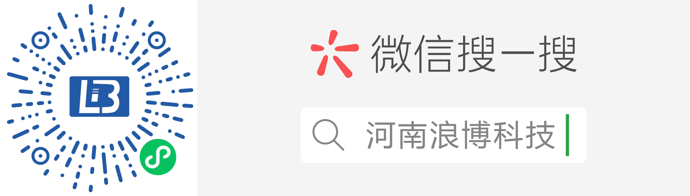
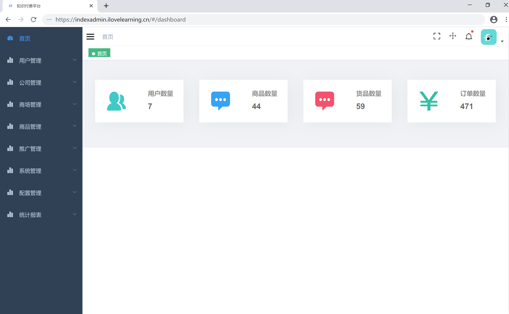
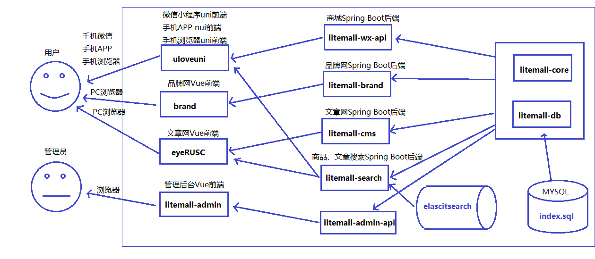
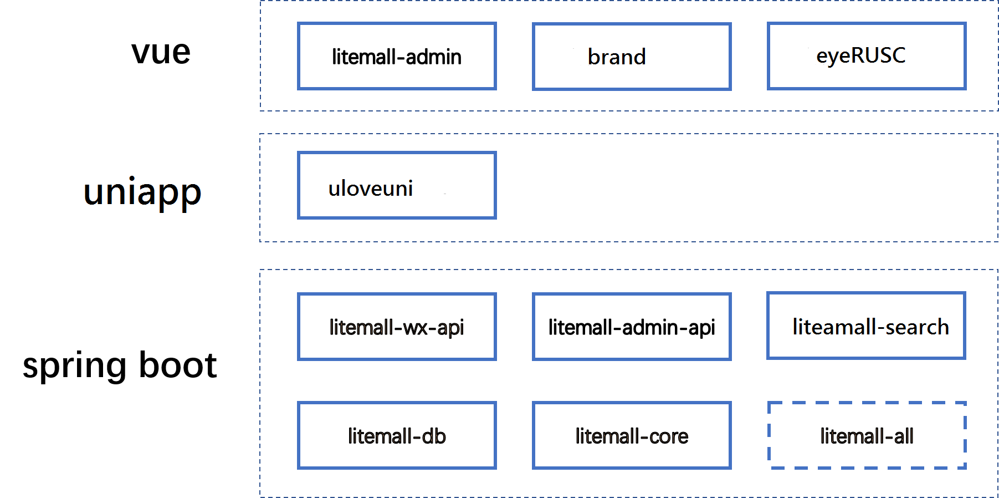

# eyeServerdev

eyeServer = Spring Boot后端 + Vue管理员前端 + Vue品牌网前端 + uni-app微信小程序用户前端 + uni-app用户移动端

* [文档](./doc/README.md)
* [贡献](./doc/CONTRIBUTE.md)
* [FAQ](./doc/FAQ.md)
* [API](./doc/api.md)

## 项目实例

### 付费知识平台微信小程序实例

* ulovemall-wx模块实例



> 由于第一次加载数据量较大，建议wifi网络访问，且耐心等待数秒。

### 付费知识平台移动app实例

* ulovemall-wx模块实例

1. 下载链接 [下载链接]()

### 付费知识平台移动浏览器实例

* ulovemall-h5模块实例

1. 手机浏览器打开: [https://index.ilovelearning.cn/](https://index.ilovelearning.cn/)

### 品牌网PC实例

1. 浏览器访问地址: []()

### 文章网实例

1.浏览器访问地址：[https://index.ilovelearning.cn/](https://index.ilovelearning.cn/)

### 管理后台实例



1. 浏览器打开，输入以下网址: [https://indexadmin.ilovelearning.cn](https://indexadmin.ilovelearning.cn)
2. 用户访问用户名`guest`，管理员密码`Guest123`
> 注意：此实例是付费知识平台的管理后台，请勿删除和更改数据。

## 项目架构


## 技术栈

> 1. Spring Boot
> 2. Uiniapp
> 3. Vue
> 4. 微信小程序



### 付费知识平台功能

* 首页
* 专题列表、专题详情
* 分类列表、分类详情
* 品牌列表、品牌详情
* 新品首发、人气推荐
* 优惠券列表、优惠券选择
* 团购、秒杀、会员
* 搜索
* 商品详情、商品评价、商品分享
* 购物车
* 下单
* 订单列表、订单详情、订单售后
* 地址、收藏、足迹、意见反馈
* 客服

### 管理平台功能

* 系统管理
* 文章管理
* 用户管理
* 商城管理
* 商品管理
* 统计报表
* 附带工具
* 外链

## 快速启动

1. 配置最小开发环境：
    * [MySQL](https://dev.mysql.com/downloads/mysql/)
    * [JDK1.8或以上](http://www.oracle.com/technetwork/java/javase/overview/index.html)
    * [Maven](https://maven.apache.org/download.cgi)
    * [Nodejs](https://nodejs.org/en/download/)
    * [XBuilder X](https://www.dcloud.io/hbuilderx.html)
    * [微信开发者工具](https://developers.weixin.qq.com/miniprogram/dev/devtools/download.html)
    * [Elasticsearch](https://www.elastic.co/cn/downloads/elasticsearch)
    * [Erlang](https://packages.erlang-solutions.com/erlang-solutions-1.0-1.noarch.rpm)
    * [RabbitMQ](http://www.rabbitmq.com/releases/rabbitmq-server/v3.6.6/rabbitmq-server-3.6.6-1.el7.noarch.rpm)

### 安装OpenJDK

yum search java-11-openjdk

yum install java-11-openjdk-devel.x86_64

### 安装Maven

wget https://mirrors.tuna.tsinghua.edu.cn/apache/maven/maven-3/3.6.3/binaries/apache-maven-3.6.3-bin.zip

unzip apache-maven-3.6.3-bin.zip

vi /etc/profile

在最后添加

export M2_HOME=/root/apache-maven-3.6.3

export PATH=$PATH:$JAVA_HOME/bin:$M2_HOME/bin

source /etc/profile
    
    
2. 数据库依次导入eye-db/sql下的数据库文件
    * 创建数据库eye
    * eye_table.sql
    * eye_data.sql

3. 启动付费知识平台和管理后台及其各个网站的后端服务

    打开命令行，输入以下命令
    ```bash
    cd eyeServer
    mvn 
    mvn clean package
    启动项目：
    nohup java -Dfile.encoding=UTF-8 -jar eye-all/target/eye-all-0.1.0-exec.jar
    查看日志：
    tail -f -n5000 nohup.out
    ```
    
4. 启动管理后台前端

    打开命令行，输入以下命令
    ```bash
    npm install -g cnpm --registry=https://registry.npm.taobao.org
    cd ulovemall/ulovemall-admin
    cnpm install
    cnpm run dev
    ```
    此时，浏览器打开，输入网址`http://localhost:9527`, 此时进入管理后台登录页面。
    
5. 启动知识付费平台微信小程序前端
   

6. 打包知识付费平台移动app前端

7. 打包知识付费平台移动H5前端

8. 启动品牌网前端

9. 启动文章网前端


        
## 开发计划

当前版本[v1.7.0](CHANGELOG.md)

目前项目开发中，存在诸多不足，以下是目前规划的开发计划。

V 1.0.0 完成以下目标：

1. 除了部分功能（如优惠券等），付费知识平台的优化和改进基本结束；
2. 管理后台基本实现所有表的CRUD操作；
3. 后端服务能够对参数进行检验。

V 2.0.0 完成以下目标：

1. 付费知识平台和管理后台完成所有基本业务；
2. 管理后台实现统计功能、日志功能、权限功能；
3. 业务代码和细节代码进行调整优化；
4. 轻商城的开发；

V 3.0.0 完成以下目标：

1. 管理后台一些辅助功能
2. 后端服务加强安全功能、配置功能
3. 缓存功能以及优化一些性能

## 警告

> 1. 本项目仅用于学习练习
> 2. 本项目还不完善，仍处在开发中，不承担任何使用后果
> 3. 本项目代码开源[MIT](./LICENSE)，项目文档采用 [署名-禁止演绎 4.0 国际协议许可](https://creativecommons.org/licenses/by-nd/4.0/deed.zh)

## 致谢

本项目基于或参考以下项目：

1. [nideshop-mini-program](https://github.com/tumobi/nideshop-mini-program)

   项目介绍：基于Node.js+MySQL开发的开源微信小程序商城（微信小程序）

   项目参考：
   
   1. eyeServer项目数据库基于nideshop-mini-program项目数据库；
   2. eyeServer项目的ulovemall-wx模块基于nideshop-mini-program开发。

2. [vue-element-admin](https://github.com/PanJiaChen/vue-element-admin)
  
   项目介绍： 一个基于Vue和Element的后台集成方案
  
   项目参考：eyeServer项目的ulovemall-admin模块的前端框架基于vue-element-admin项目修改扩展。

3. [mall-admin-web](https://github.com/macrozheng/mall-admin-web)

   项目介绍：mall-admin-web是一个电商后台管理系统的前端项目，基于Vue+Element实现。

   项目参考：eyeServer项目的ulovemall-admin模块的一些页面布局样式参考了mall-admin-web项目。

4. [biu](https://github.com/CaiBaoHong/biu)

   项目介绍：管理后台项目开发脚手架，基于vue-element-admin和springboot搭建，前后端分离方式开发和部署。

   项目参考：eyeServer项目的权限管理功能参考了biu项目。

5. [vant--mobile-mall](https://github.com/qianzhaoy/vant--mobile-mall)

   项目介绍：基于有赞 vant 组件库的移动商城。

   项目参考：eyeServer项目的ulovemall-vue模块基于vant--mobile-mall项目开发。

## 推荐

1. [Flutter_Mall](https://github.com/youxinLu/mall)
   
   项目介绍：Flutter_Mall是一款Flutter开源在线商城应用程序。
   
2. [Taro_Mall](https://github.com/jiechud/taro-mall)

    项目介绍：Taro_Mall是一款多端开源在线商城应用程序，后台是基于litemall基础上进行开发，前端采用Taro框架编写。


## 问题


 * 开发者有问题或者好的建议可以用Issues反馈交流，请给出详细信息
 * 在开发交流群中应讨论开发、业务和合作问题
 * 如果真的需要QQ群里提问，请在提问前先完成以下过程：
    * 请仔细阅读本项目文档，特别是是[**FAQ**](./doc/FAQ.md)，查看能否解决；
    * 请阅读[提问的智慧](https://github.com/ryanhanwu/How-To-Ask-Questions-The-Smart-Way/blob/master/README-zh_CN.md)；
    * 请百度或谷歌相关技术；
    * 请查看相关技术的官方文档，例如微信小程序的官方文档；
    * 请提问前尽可能做一些DEBUG或者思考分析，然后提问时给出详细的错误相关信息以及个人对问题的理解。

## License

[MIT](./LICENSE)
Copyright (c) 2018-present linlinjava


