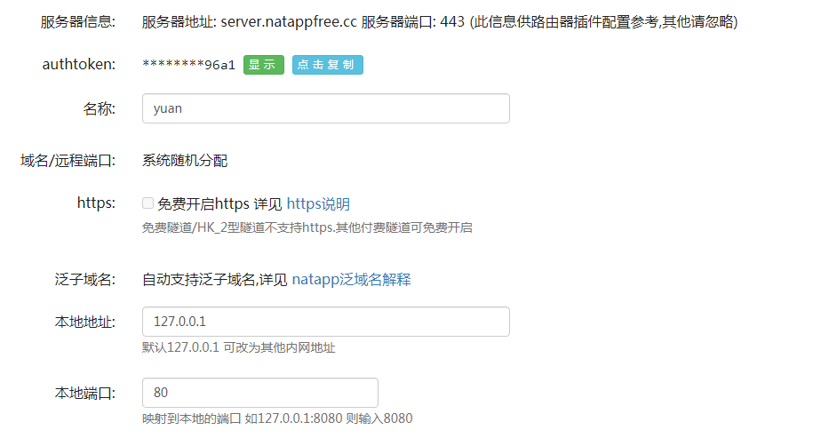
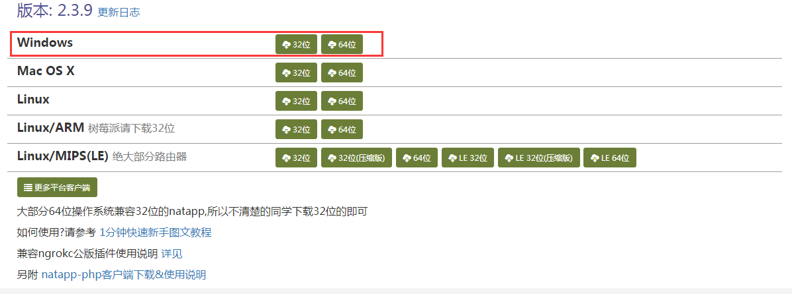
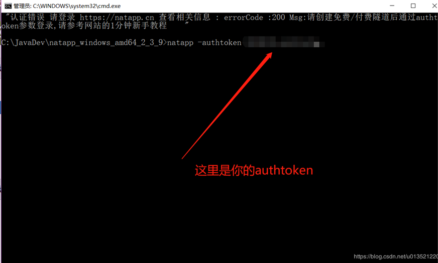
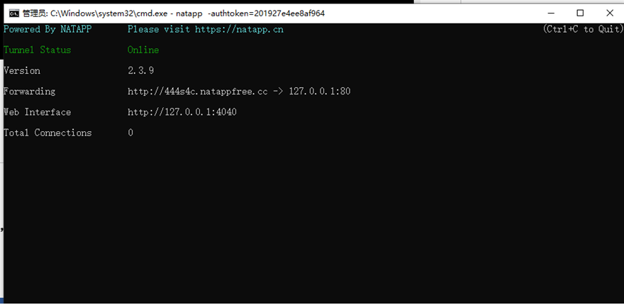

#内网穿透
这里讲解的内网穿透是基于natapp.cn的内网穿透

##内网穿透的步骤：

第一步：注册https://natapp.cn/账户

第二步：实名认证

第三步：添加免费隧道

第四步：下载natapp客户端（https://natapp.cn/#download）

第五步：下载之后，双击打开natapp.exe程序，然后输入natapp –authtoken=申请的authtoken值 

