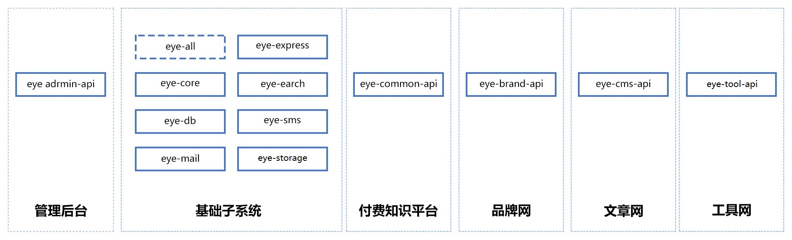
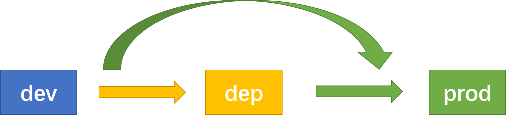
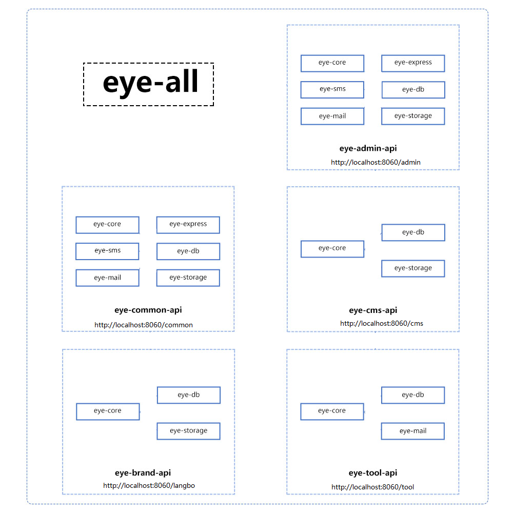
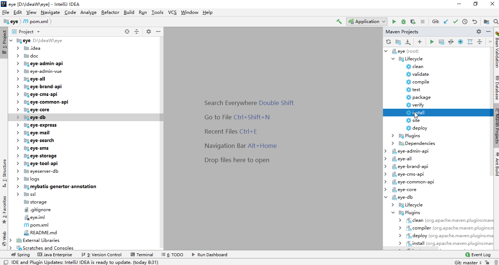
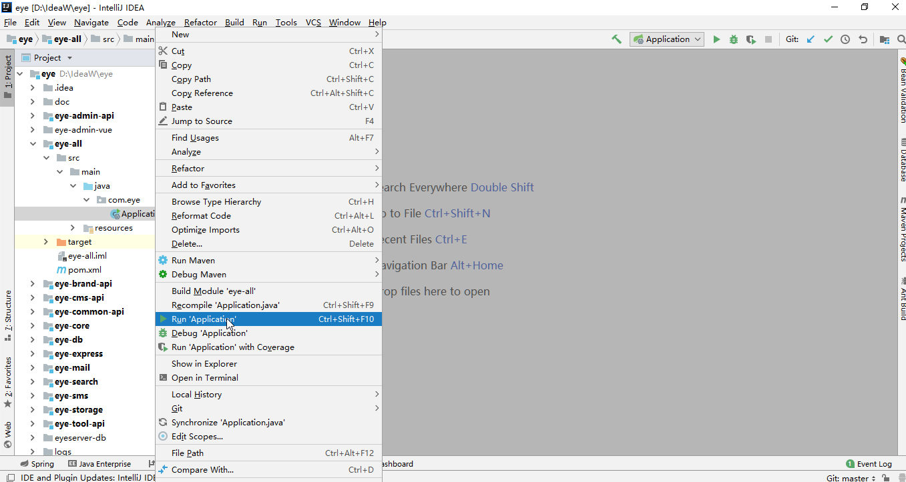
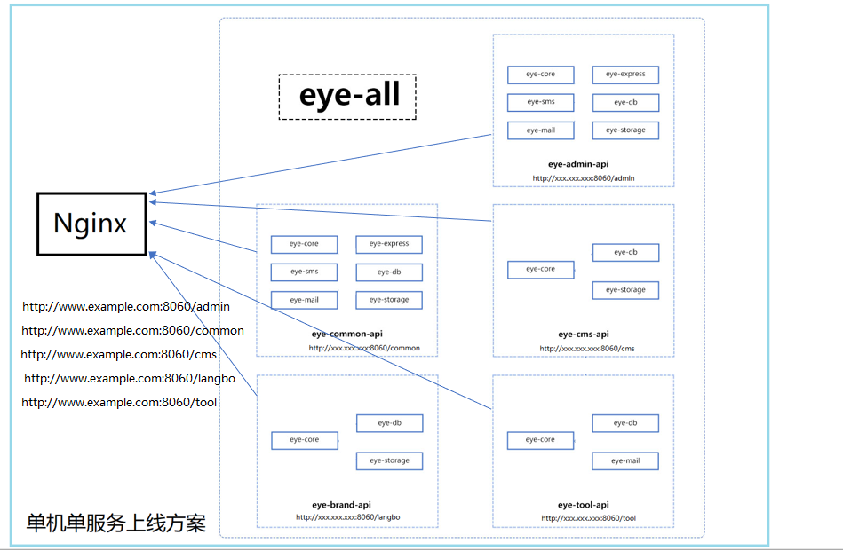
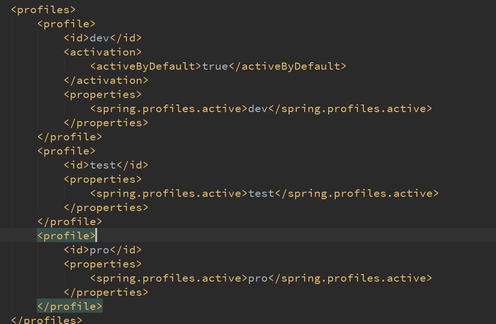

# 1 eyeServer系统

## 1.1 简介

eyeServer是一个简单的商场系统，基于现有的开源项目，重新实现一个完整的前后端项目，包含小程序客户端、移动客户端和网页管理端。

项目的架构是六个系统和十四个模块：

* 基础系统子系统(platform)

  由数据库、eye-core模块、eye-db模块、eye-mail模块、eye-serrcha模块、eye-brand模块、eye-sms模块、eye-storage模块和eye-all模块组成;

* 付费知识平台子系统

  由eye-common-api模块组成；
  
* 管理后台子系统(admin)

  由eye-admin-api模块组成。

* 品牌网子系统（brand）
  
  由eye-brand-api模块组成

* 文章网子系统（cms）

  由eye-cms-api模块组成

* 工具网子系统（tool）

  由eye-tool-api组成

而九个模块的开发设计到三种技术栈：

* Spring Boot技术栈

  采用IDEA开发工具，mybatis-genertor-annotation、eye-core、eye-db、eye-sms、eye-mail、eye-express、eye-search、eye-storage、eye-admin-api、
  eye-common-api和eye-brand-api、eye-cms-api、eye-tool-api、eye-all共十四个模块；

### 1.1.1 项目特点

项目存在以下特点：

* 数据库方面，只是简单的表，表和表之间的依赖关系没有采用外键设计，而是依赖Java代码在service层面或者业务层面保证。这样做的好处是数据库频繁改动很方便，不会因为外键而导致数据库难以修改;
  * 后端技术栈，仅涉及 Spring，Spring Boot, Spring MVC和Mybatis技术，其他后端技术暂时不采用;
* 安全方面，仅采用最基本的代码，提供简单基本的安全服务;
* 性能方面，没有涉及内存数据库缓存功能，而是完全依赖MySQL;
* 对象存储服务方面，支持本地存储和第三方云存储方案。
* 消息通知方面，支持邮件通知、第三方云短信通知和微信模板通知；
* 部署方便，支持多服务部署和一键部署脚本；
* 文档全面，虽然还在开发中，但是规划中文档和代码注释一定会完成，帮助开发者理解项目。

总之，目前的系统只是为了学习技术和业务而开发的一个简单商场原型系统。虽然缺失很多企业级功能，但是是完整和合理的原型系统。

注意：
> 以上特点并不一定是优点。

## 1.2 系统功能

从业务功能上，目前由六个业务模块组成：

* 会员业务模块
* 商场业务模块
* 商品业务模块
* 推广业务模块
* 系统业务模块
* 配置业务模块

### 1.2.1 付费知识平台功能

* 首页
* 专题列表、专题详情
* 分类列表、分类详情
* 品牌列表、品牌详情
* 新品首发、人气推荐
* 团购
* 搜索
* 商品详情
* 商品评价列表、商品评价
* 购物车
* 下单
* 个人
* 订单列表、订单详情、订单售后
* 地址列表、地址添加、地址删除
* 收藏、足迹、关于

### 1.2.2 管理平台功能

* 会员管理
  * 会员管理
  * 收货地址
  * 会员收藏
  * 会员足迹
  * 搜索历史
  * 意见反馈
* 商城管理
  * 行政区域
  * 品牌制造商
  * 订单管理
  * 商品类目
  * 通用问题
  * 关键词
  * 渠道管理（待定）
* 商品管理
  * 商品列表
  * 商品上架
  * 商品编辑
  * 用户评论
* 推广管理
  * 广告管理
  * 专题管理
  * 团购规则
  * 团购活动
* 系统管理
  * 管理员
  * 通知管理
  * 对象存储
  * 权限管理
  * 定时任务（待定）
  * 操作日志
* 配置管理
  * 商场配置
  * 小程序配置
  * 运费配置
  * 订单配置
* 统计报表
  * 用户统计
  * 订单统计
  * 商品统计
* 个人
  * 通知中心
  * 密码修改

## 1.3 项目技术
  
### 1.3.1 项目阶段

接下来，从项目的开发、部署（测试）和上线三个阶段介绍eyeServer。



首先需要明确的是三个不同阶段：

* dev

即develop或者development, 这里指开发阶段，通常代码是直接在本地编译、运行和测试。
此外，这里服务访问地址通常是localhost。这里的“用户”主要是指开发者本身。

* dep

即deploy或者deployment，这里指部署（测试阶段），通常代码已经编译打包运行在远程服务器中，
可以对外服务。此外，这里服务访问地址通常是IP地址。如果IP是公网IP，那么
部署以后就可以对外服务；如果是内网地址，那么只能内网访问。这里的“用户”主要是
指开发者本身、测试者；当然，如果是局域网或者不介意IP访问的，那么这里的“用户”
也可能是最终使用者用户。

* prod

即product或者production，这里指上线阶段，通常也是代码编译打包运行在远处服务器中可以对外服务。
此外，这里服务访问地址通常是域名地址，同时端口是80web端口。上线以后直接面向的是最终用户。
虽然服务的代码本身和dep是完全一样的，但是考虑到场景的不同，上线阶段可能在运行环境方面需要做
调整，例如采用反向代理屏蔽内部实际项目结构。此外，最大的不同应该是上线环境下要使用域名和80端口，
而部署阶段则更为自由。

其次，需要明确的是，这里划分三种阶段不是简单的文档说明，还直接影响项目本身的行为
和代码编译结果，因此开发者需要清晰的了解；

最后，其实dep和prod不存在先后关系。例如，如果开发者已经存在域名和生产环境，可以直接
跳过dep阶段，而直接部署在线上环境中。因此有些时候，这里部署和上线是一个阶段。

当然，这里仍然建议先dep后prod，是因为对于第一次开发而言，先dep阶段可以避免对域名、https证书等非业务相关工作的干扰。

此外，有些业务功能（例如微信支付）必须是域名访问，那么开发和部署阶段可以先采用模拟或跳过的形式，
先不开发和测试这样业务功能，等其他功能开发完毕和部署测试成功以后，再来开发这些线上环境才能
运行的功能，此时会有一个好的基础。

接下来，分别从开发阶段、部署阶段和上线阶段三种阶段，分别介绍不同的方案实践要点。

## 1.4 开发方案



如图所示，当前开发阶段的方案：

* MySQL数据访问地址`jdbc:mysql://localhost:3306/eye`
* eye-common-api后端服务地址`http://localhost:8080/common`，数据则来自MySQL
* eye-admin-api后端服务地址`http://localhost:8080/admin`,数据则来自MySQL
* eye-cms-api后端服务地址`http://localhost:8080/cms`,数据则来自MySQL
* eye-brand-api后端服务地址`http://localhost:8080/langbo`,数据则来自MySQL
* eye-tool-api后端服务地址`http://localhost:8080/tool`,数据则来自MySQL


### 1.4.1 数据库

数据库环境设置过程如下：

1. 安装MySQL;

2. 创建数据库、用户权限、数据库表和测试数据;
   数据库文件存放在eye-db/sql文件夹中，请开发者在MySQL中
   按照顺序运行以下脚本:
   * eye_table.sql，用于创建表;
   * eye_data.sql，用于导入测试数据。

注意：
> 建议采用命令行或者MySQL Workbench。如果采用Navicat可能导入失败。

### 1.4.2 Spring Boot开发环境

1. 安装JDK8（可以是Oracle JDK或者OpenJDK）
2. 安装Maven
3. 安装Git（可选）
4. 安装IDEA Community，建议安装Maven插件和Git插件。
   这里IDEA社区版即可，不要求IDEA商业版。
   Eclipse没有试过，但应该也是可行的。
5. IDEA导入本项目
6. 采用Maven命令安装依赖库

   例如：
   ```
   cd eye
   mvn install
   ```
   
   或者采用IDEA的Maven插件安装本项目依赖库，点击`install`

    

7. 采用Maven命令编译本项目

   例如：
   ```
   cd eye
   mvn compile
   ```

   此时可以看到，eye-common-api等模块多了target文件夹，里面是编译出的文件。
   
   或者采用IDEA的Maven插件编译本项目，点击`compile`
   
   如果采用IDEA也可以跳过当前步骤，直接步骤8（因为运行时会自动编译再运行）。
   
8. 采用Maven命令运行本项目的eye-all

   例如：
   ```
   cd eye/eye-all
   mvn spring-boot:run
   ```
   
   如果采用IDEA，则eye-all模块的Application类
   右键` Run Application.main()`方式运行该模块,
   
   
   
   打开浏览器，输入
    ```
    http://localhost:8080/common/index/index
    http://localhost:8080/admin/index/index
    ```
    如果出现JSON数据，则eye-all模块运行正常。
   

注意：
> 1. 上述步骤中，既介绍了Maven命令方式，也介绍了IDEA方式，
>   但是建议开发者开发阶段采用IDEA。
> 2. 上述步骤只是一种实践方式，开发者可不拘泥于这些步骤，多实践。
>   当然，如果开发者不采用这里步骤而出现问题，请自行解决。

## 1.5 上线方案

在1.5节部署方案中，我们介绍了多种部署的方案，但是实际上这些方案都不能立即用于正式环境：

1. 正式环境需要域名和HTTPS证书
2. 小商场的小程序端对服务器域名存在接入要求。

本节采用`www.example.com`域名作为示例。

注意
> `www.example.com`仅作为实例，不是真实环境下的域名。

这里列举一种基于1.5.1的单机单服务上线方案，即一个all后端服务，同时提供三种数据：
* 提供管理后台的前端文件；
* 提供管理后台前端所需要的数据；
* 提供小商城前端所需要的数据。




开发者可以基于自身业务采用其他上线方案。

### 1.5.1 域名

1. 注册域名，通常商业性的网站采用`.com`
2. 解析域名到服务器公网IP，采用`ping`命令查看是否解析成功
3. 备案

### 1.5.2 nginx

https://www.digitalocean.com/community/tutorials/how-to-install-nginx-on-ubuntu-16-04

#### 1.5.2.1 nginx安装

采用命令
```bash
sudo apt-get update
sudo apt-get install nginx
```

有的文档会指出需要防火墙设置，但是腾讯云服务器防火墙默认没有开启。
开发者这里自己可以开启设置，或者直接不开启。

打开浏览器，输入以下地址：
```
http://www.example.com
```

此时，如果看到nginx的欢迎页面，则安装成功。

安装以后：
* `/var/www/html`：默认静态web文件目录
* `/etc/nginx`:
* `/etc/nginx/nginx.conf`:
* `/etc/nginx/sites-avaiable`:
* `/etc/nginx/sites-enabled`:
* `/etc/nginx/snippets`:
* `/var/log/nginx/access.log`:
* `/var/log/nginx/error.log`:

#### 1.5.2.2 https

1. 申请证书
   
   可以参考[腾讯云 域名型证书申请流程](https://cloud.tencent.com/document/product/400/6814)

2. 下载证书

   这里使用nginx文件夹下面的密钥文件，例如`1_www.example.com_bundle.crt`和`2_www.example.com.key`

3. 部署证书到nginx

   可以参考[腾讯云 证书安装指引](https://cloud.tencent.com/document/product/400/4143)
   把两个密钥文件保存的`/etc/nginx`文件夹，然后修改`/etc/nginx/nginx.conf`文件：
   ```
	  server {
		listen 443;
		server_name www.example.com;
		ssl on;
		ssl_certificate /etc/nginx/1_www.example.com_bundle.crt;
		ssl_certificate_key /etc/nginx/2_www.example.com.key;
		ssl_session_timeout 5m;
		ssl_protocols TLSv1 TLSv1.1 TLSv1.2;
		ssl_ciphers ECDHE-RSA-AES128-GCM-SHA256:HIGH:!aNULL:!MD5:!RC4:!DHE;
		ssl_prefer_server_ciphers on;
      }
   ```
   
4. 重启nginx

打开浏览器，输入以下地址：
```
https://www.example.com
```

此时，可以看到https协议的nginx欢迎页面。

#### 1.5.2.3 反向代理Spring Boot后端

修改`/etc/nginx/nginx.conf`文件，配置nginx静态web文件目录
```
server {
    location / {
        proxy_pass  http://localhost:8080;
        proxy_set_header    Host    $host;
        proxy_set_header    X-Real-IP   $remote_addr;
        proxy_set_header    X-Forwarded-For $proxy_add_x_forwarded_for;
    }
}
```

打开浏览器，输入以下地址：
```
https://www.example.com/wx/index/index
https://www.example.com/admin/index/index
https://www.example.com/admin/index/index
```

此时，看到后端数据说明反向代理配置成功。

#### 1.5.2.4 全站加密

服务器自动把http的请求重定向到https

```
server {
    listen 80;
    server_name www.example.com;
    rewrite https://$server_name$request_uri? permanent;
}
```

打开浏览器，输入以下地址：
```
http://www.example.com
```

总结，经过以上不同方面的配置，nginx这里最终的配置是如下：
1. 证书`1_www.example.com_bundle.crt`和`2_www.example.com.key`放置在
    `/etc/nginx/`文件夹内。
2. 把`/etc/nginx/nginx.conf`文件进行修改，具体可以参考[本项目的nginx.conf](./conf/nginx.conf)
3. 重启nginx

注意：
> 更多配置方法和功能，请开发者自行学习。

### 1.5.3 小商场上线

在1.6.2.3节"反向代理Spring Boot后端"成功以后，其实小商场的后端已经上线成功。
这里介绍小商场的前端上线过程：

上线之前需要修改代码或者配置文件：
1. eye-wx-api模块的WxOrderController类的payNotify方法的链接换成合适的地址。

   注意：
   > 换成什么地址都可以，但是这里不应该暴露出来。也就是说这个地址是微信商户平台
   > 和这里的小商场后端服务之间的交互API，对外公开会存在安全隐患。
   
2. eye-core模块需要配置application-core.yml

    ```
    eye:
        wx:
            app-id: wxa5b486c6b918ecfb
            app-secret: e04004829d4c383b4db7769d88dfbca1
            mch-id: 111111
            mch-key: xxxxxx
            notify-url: http://www.example.com/wx/order/pay-notify
    ```
    
    这里的`eye.wx.notify-url`就是前面开发者自定义的地址。
    
3. eye-wx模块的`project.config.json`文件调整相应的值，
   特别是`appid`要设置成开发者申请的appid。

### 1.5.4 管理后台上线

在1.6.2.3节"反向代理Spring Boot后端"成功以后，其实管理后台已经上线成功，
包括管理后台的前端和后端，会同时对外提供管理后台的前端文件和后端数据。
当然，这里开发者需要自己的线上环境在以下文件中或代码中修改相应的配置。

1. MySQL数据库设置合适的用户名和密码信息；
2. 管理后台后端服务模块设置合适的配置信息，建议开发者参考deploy/eye的外部配置文件，
   这样可以避免开发者对模块内部的开发配置文件造成修改；
3. 管理后台前端eye-admin模块`.env.production`中的`VUE_APP_BASE_API`设置管理后台后端服务的服务地址。

### 1.5.5 项目评估

本项目只是参考项目，项目代码质量和功能不可能符合开发者的最终需求，
因此开发者**请务必仔细评估项目代码**。

特别提醒，上线前管理员用户名和密码请更改，不能采用这里的默认值。

### 1.5.6 项目优化

以下是部署方案中出现而在上线方案中可以优化的一些步骤。

#### 1.5.6.1 管理后台前端文件启动优化

eye-admin编译得到的前端文件在第一次加载时相当耗时，这里需要一些措施来优化启动速度

* 静态文件托管CDN

  在上节中，采用Spring Boot来分发管理后台的静态文件。
  这里可以进一步地，把静态文件托管到CDN，当然这里是需要收费。

* gzip压缩

* 动态加载

#### 1.5.6.2 后端服务内部访问

原来后端服务（包括小商城的后端服务和管理后台的后端服务）可以通过域名或者IP直接对外服务，而这里采用nginx反向代理后可以
通过80端口访问后端服务。因此，会存在这样一种结果：
* 用户可以https协议的80端口访问后端服务（nginx反向代理）
* 用户也可以通过http协议的8080访问后端服务（spring boot）
由于http不是安全的，这里可能存在安全隐患

而如果取消后端服务的对外访问，这样可以保证用户只能采用安全的https协议访问后端服务。
同时，对外也能屏蔽内部具体技术架构细节。

#### 1.5.6.4 nginx优化

建议开发者根据自己业务或架构情况优化。

### 1.5.7 项目安全

项目一旦正式上线，即对外正式服务。但是服务同时，可能会存在安全隐患甚至黑客攻击。

本节仅列举一些注意事项，欢迎开发者补充和完善。

#### 1.5.7.1 账户安全

这里的账号安全，既包括商城端用户账户，也包括管理后台端管理员账户。

目前账号安全还缺乏一点的保护措施，例如

* 用户密码失败超过阈值，则显示验证码；
* 用户密码失败超过阈值，则取消登录；
* 用户密码失败超过阈值，则需要手机验证码；

#### 1.5.7.2 关键业务记录

有关订单或者金钱相关的操作，建议开发者尽可能记录在数据库中，以便以后回溯。

#### 1.5.7.3 API统一调整

本项目公布了参考API接口，如果出现BUG可能会被黑客作为入口。
建议开发者上线之前可以统一调整接口，以减少安全隐患。

#### 1.5.7.4 对账

本项目管理后台没有对账功能，建议开发者可以开发对账比对商场的状态是否正常。

#### 1.5.7.5 取消或者限制退款

本项目不支持自动退款功能，而是在管理后台通过管理员点击退款按钮来人工退款。
但是仍然可能存在隐患，例如黑客通过漏洞进入管理后台从而进行不合理的退款操作。

因此建议开发者可以取消管理后台的退款按钮，而仅仅保持退款信息，管理员可以登录
微信官方支付平台进行退款操作。

或者建议开发者基于一定的业务逻辑或场景限制管理后台的退款功能。例如，设置当天
退款限额从而保证不会产生无限退款操作。

#### 1.5.7.6 资源限制访问

一些API操作涉及到后端服务器资源，因此需要做一定的限制，防止有限资源被恶意消耗。

有限资源可能包括：

* 验证码
* 图片上传

一些限制措施可能包括：

* 限制单个IP的访问频率
* 限制用户上传图片数量

#### 1.5.7.n 跟踪本项目进展

一旦有开发者反馈BUG，本项目会优先解决并及时上传补丁。
因此建议开发者跟踪本项目进展，留意每次BUG修复的commit。

同时也希望开发者发现任何BUG都及时反馈。

目前还不存在LTS版本，未来业务稳定后可能会发布。

## 1.6 项目管理

这里简述一些当前项目开发的要点。

### 1.6.1 项目.gitignore

当前项目的.gitignore不是单一文件，而是多个模块都存在：
* deploy/.gitignore
* eye-admin/.gitignore
* eye-admin-api/.gitignore
* eye-core/.gitignore
* eye-db/.gitignore
* eye-wx-api/.gitignore
* eye-all/.gitignore
* .gitignore

开发者可以采用单一.gitignore文件。

### 1.6.2 项目自动部署

#### 1.6.2.1 deploy部署

当前项目存在deploy部署文件夹，这个是上述1.5.1节部署腾讯云服务器所采取的一些脚本。

流程如下：
1. util脚本是当前开发服务器运行，用来打包项目和上传腾讯云服务器；
2. 打包项目时，会编译打包项目相关模块到eye和db文件夹中；
3. bin脚本是云服务器运行，用来安装数据库、导入数据、启动项目服务。

这里deploy部署方式比较简单不灵活，开发者可以参考开发自己的项目脚本。

#### 1.6.2.2 .gitlab-ci.yml部署

目前不支持

#### 1.6.2.3 docker部署

目前不支持

### 1.6.3 项目代码风格

由于本项目涉及三种技术栈，因此针对这三种技术栈也存在三种代码风格。

如果开发者想要贡献代码，建议尽可能保证代码符合这里的规范。

#### 1.6.3.1 Spring Boot技术栈代码风格

这里的代码风格采用IDEA默认代码风格。

修改代码后，利用`Code`菜单的`Reformat Code`即可格式化代码。

#### 1.6.3.2 小程序技术栈代码风格

这里的代码风格采用微信开发者工具默认代码风格。

修改代码以后，利用`编辑`菜单的`格式化代码`即可格式化代码。

#### 1.6.3.3 Vue技术栈代码风格

这里的代码风格采用ESLint配置代码风格，具体参考vue-element-admin下项目的
[ESLint文档](https://panjiachen.github.io/vue-element-admin-site/zh/guide/advanced/eslint.html),
特别是`vscode 配置 ESLint`内容。

注意：
> Visual Studio Code编辑器中右键存在`格式化代码`的选项，但是请不要使用这种方式，
> 因为VSC自带的格式化代码风格和ESLint代码风格可能不完全一致。

### 1.6.4 Spring Boot多模块多阶段配置

目前后端服务采用Spring Boot多模块方案，结构清晰、易于测试。

但是存在一个问题，即多模块配置依赖。
例如，eye-db模块存在数据库配置信息，那么其他模块如何引入
eye-db模块的配置信息呢？

最简单的方式，就是其他模块把eye-db模块的配置信息拷贝到自己的
application配置文件中，但是问题就是数据库信息一旦改变则其他模块又要
再次手动修改，非常不方便。

目前本项目采用一种基于`spring.profiles.active`的方式，细节如下：
1. eye-db模块存在application.yml和application-db.yml两个配置文件，
    在application-db.yml配置文件中存放数据库配置信息；
2. eye-core模块也存在application.yml和application-core.yml两个配置文件,
    在application-core.yml配置文件中存放core模块的一些配置信息，而在application.yml
    中存在这样一个配置：
    ```
    spring:
        profiles:
            active: core, db
    ```
    因此，如果单独启动eye-core模块，则会先读取application.yml配置文件，然后基于
    系统会根据`spring.profiles.active`读取application-db.yml和application-core.yml配置文件，
    因此就会自动读取eye-db模块的配置文件。
3. 以此类推，在eye-all模块中存在application.yml配置文件，其中内容是
    ```
    spring:
        profiles:
            active:  db, core, admin, wx
    ```
    因此，系统启动eye-all模块以后，则会先读取application.yml配置文件，然后基于
    `spring.profiles.active`进一步读取application-db.yml、application-core.yml、
    application-admin.yml和application-wx.yml四个模块的配置文件。

但是，虽然以上方案解决了多模块配置依赖问题，但是又会导致另外一个问题，如何支持不同profile，
也就是开发阶段、测试阶段和上线阶段配置不同。

这里介绍本项目的思路，就是基于Spring Boot的配置加载顺序，采用外部配置文件覆盖jar包内部配置文件。
1. 开发阶段，系统的配置信息在模块的resources目录配置文件中；
2. 测试或者部署阶段，系统打包成一个eye.jar二进制jar包，jar包内部配置文件是之前
    开发阶段的配置文件，此时在eye.jar的同级目录创建相同的配置文件，在这些配置文件则
    保存了测试或者部署阶段的配置信息。启动eye.jar时，系统会读取当前目录的配置文件，而
    不再读取jar包内部的配置文件。
3. 上线阶段，同样地，在eye.jar包同级目录创建上线配置文件。

此外，这里还可以采用另外一种思路，如下图：



其实原理也很简单，就是配置文件采用application-{module}-{profile}.yml来支持不同模块不同阶段的配置需求。

### 1.6.5 前后端校验

本项目是前后端分离项目，当用户或者管理员在系统中输入数据时，
数据需要进行两层校验。

* 第一层是前端校验，是对参数格式校验。
* 第二层是后端校验，不仅对参数校验，还会根据业务场景进行校验。

注意
> 目前项目校验思路是这样，但是实际代码的校验还不完善，
> 例如前端校验代码不完善，导致用户体验较差。

### 1.6.6 后端响应错误码

后端服务的响应结果是：
```
{
    errno： 错误码，
    errmsg：错误消息，
    data：  响应数据
}
```

当errno是0时，则data保存业务数据；
当error是非0时，则业务失败，errmsg保存具体错误信息。

目前，errno存在四种形式：
* 4xx，前端错误，说明前端开发者需要重新了解后端接口使用规范：
  * 401，参数错误，即前端没有传递后端需要的参数；
  * 402，参数值错误，即前端传递的参数值不符合后端接收范围。
* 5xx，后端系统错误，除501外，说明后端开发者应该继续优化代码，尽量避免返回后端系统错误码：
  * 501，验证失败，即后端要求用户登录；
  * 502，系统内部错误，即没有合适命名的后端内部错误；
  * 503，业务不支持，即后端虽然定义了接口，但是还没有实现功能；
  * 504，更新数据失效，即后端采用了乐观锁更新，而并发更新时存在数据更新失效；
  * 505，更新数据失败，即后端数据库更新失败（正常情况应该更新成功）。
* 6xx，管理后台后端业务错误码，具体见eye-admin-api模块的`AdminResponseCode`类。
* 7xx，小商城后端业务错误码，具体见eye-common-api模块的`WxResponseCode`类。

需要指出的是，小商场后端可能返回4xx、5xx和6xx错误码；管理后台后端则可能返回4xx、5xx和7xx错误码。
这样设计原因是方便小商场前端和管理后台前端区别对待。

小商城前端处理后端响应错误码，存在三种处理方式：
* 如果是4xx，说明前端开发者请求后端API时使用方式存在问题。
例如，后端需要参数“name”，但是前端却没有传值，这个时候后端返回”用户名不对“
没有任何意义，因为这里前端使用错误。相反，简单地返回“参数不对”反而会及早提醒
前端开发者使用出现了问题。
* 如果是5xx，（除501外）说明后端系统出现错误，后端开发者应该修复或者优化，此外
前端可以在请求响应处统一处理5xx错误，而不是把错误信息返回到具体页面。
例如，后端返回“更新数据失败”，说明数据库更新时出现异常，因此前端请求响应处
统一简单报错“系统出错，联系管理员”，这样管理员可以及时联系后端开发者。而后端开发者
则需要评估具体错误码和错误信息，例如这里的“更新数据失败”很可能是数据表调整字段
导致Java代码的模型对象和数据库表不一致，此时后端开发者就可以及时修复。
此外，对于501验证失败，则前端请求响应处可以统一处理跳转登录页面。
* 如果是6xx，则说明是具体业务错误，此时前端需要在业务具体页面显示错误信息即可，同时
这里也要求后端开发者书写良好友好的业务错误信息，因为会向最终用户显示。

和小商场前端类似，管理后台前端处理后端响应错误码也存在三种类似的处理方式。

注意：
> 这里的4xx和5xx错误码，和HTTP中的4xx和5xx状态码不是一个概念。

### 1.6.7 TODO

本项目存在一些TODO，**强烈建议**开发者上线前仔细审阅是否存在问题和做相应调整。
开发者可以使用IDE找到这些TODO。

下面列出一些重要的TODO：

#### 1.6.7.1 微信退款TODO

管理后台管理员点击退款按钮时，管理后台会通过微信退款API请求微信商户平台退款。
但是从安全角度考虑，**强烈建议**开发者删除微信退款代码，而登录微信商户平台手动退款。
或者开发者添加安全相关代码，例如实现短信验证码。

见`AdminOrderController`类

再次提醒，本项目不承担任何使用后果。

#### 1.6.7.2 未完善TODO

有些业务只是实现基本功能，因此这里TODO提醒开发者自行思考。

#### 1.6.7.3 重构TODO

有些业务需求不是很清晰，导致实现时可能存在不合理地方，这里TODO提醒
开发者审阅代码逻辑。