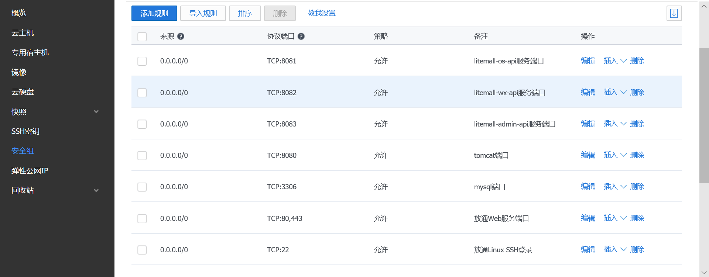
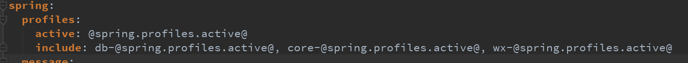

# 1 eyeServer系统

## 1.1 简介

eyeServer是一个简单的商场系统，基于现有的开源项目，重新实现一个完整的前后端项目，包含小程序客户端、移动客户端和网页管理端。

项目的架构是六个系统和十四个模块：

* 基础系统子系统(platform)

  由数据库、eye-core模块、eye-db模块、eye-mail模块、eye-serrcha模块、eye-brand模块、eye-sms模块、eye-storage模块和eye-all模块组成;

* 付费知识平台子系统

  由eye-common-api模块组成；
  
* 管理后台子系统(admin)

  由eye-admin-api模块组成。

* 品牌网子系统（brand）
  
  由eye-brand-api模块组成

* 文章网子系统（cms）

  由eye-cms-api模块组成

* 工具网子系统（tool）

  由eye-tool-api组成

而九个模块的开发设计到三种技术栈：

* Spring Boot技术栈

  采用IDEA开发工具，mybatis-genertor-annotation、eye-core、eye-db、eye-sms、eye-mail、eye-express、eye-search、eye-storage、eye-admin-api、
  eye-common-api和eye-brand-api、eye-cms-api、eye-tool-api、eye-all共十四个模块；

### 1.1.1 项目特点

项目存在以下特点：

* 数据库方面，只是简单的表，表和表之间的依赖关系没有采用外键设计，而是依赖Java代码在service层面或者业务层面保证。这样做的好处是数据库频繁改动很方便，不会因为外键而导致数据库难以修改;
  * 后端技术栈，仅涉及 Spring，Spring Boot, Spring MVC和Mybatis技术，其他后端技术暂时不采用;
* 安全方面，仅采用最基本的代码，提供简单基本的安全服务;
* 性能方面，没有涉及内存数据库缓存功能，而是完全依赖MySQL;
* 对象存储服务方面，支持本地存储和第三方云存储方案。
* 消息通知方面，支持邮件通知、第三方云短信通知和微信模板通知；
* 部署方便，支持多服务部署和一键部署脚本；
* 文档全面，虽然还在开发中，但是规划中文档和代码注释一定会完成，帮助开发者理解项目。

总之，目前的系统只是为了学习技术和业务而开发的一个简单商场原型系统。虽然缺失很多企业级功能，但是是完整和合理的原型系统。

注意：
> 以上特点并不一定是优点。

## 1.2 系统功能

从业务功能上，目前由六个业务模块组成：

* 会员业务模块
* 商场业务模块
* 商品业务模块
* 推广业务模块
* 系统业务模块
* 配置业务模块

### 1.2.1 付费知识平台功能

* 首页
* 专题列表、专题详情
* 分类列表、分类详情
* 品牌列表、品牌详情
* 新品首发、人气推荐
* 团购
* 搜索
* 商品详情
* 商品评价列表、商品评价
* 购物车
* 下单
* 个人
* 订单列表、订单详情、订单售后
* 地址列表、地址添加、地址删除
* 收藏、足迹、关于

### 1.2.2 管理平台功能

* 会员管理
  * 会员管理
  * 收货地址
  * 会员收藏
  * 会员足迹
  * 搜索历史
  * 意见反馈
* 商城管理
  * 行政区域
  * 品牌制造商
  * 订单管理
  * 商品类目
  * 通用问题
  * 关键词
  * 渠道管理（待定）
* 商品管理
  * 商品列表
  * 商品上架
  * 商品编辑
  * 用户评论
* 推广管理
  * 广告管理
  * 专题管理
  * 团购规则
  * 团购活动
* 系统管理
  * 管理员
  * 通知管理
  * 对象存储
  * 权限管理
  * 定时任务（待定）
  * 操作日志
* 配置管理
  * 商场配置
  * 小程序配置
  * 运费配置
  * 订单配置
* 统计报表
  * 用户统计
  * 订单统计
  * 商品统计
* 个人
  * 通知中心
  * 密码修改

## 1.3 项目技术

### 1.3.1 技术参考

#### 1.3.1.1 Spring Boot技术

Spring Boot技术栈参考以下文档或者项目：

1. MySQL

   了解创建数据库和表、添加、查询、更新和删除即可。
   
2. Spring Boot 2.x

    * https://docs.spring.io/spring-boot/docs/2.1.5.RELEASE/reference/htmlsingle/#getting-started-introducing-spring-boot
    * https://docs.spring.io/spring-boot/docs/2.1.5.RELEASE/reference/htmlsingle/#using-boot-maven

    这里需要了解RestController, Service等注解，以及如何使用自动化配置。 
    Spring Boot支持很多功能，开发者使用时查阅。
    
3. Mybatis

    * http://www.mybatis.org/mybatis-3/
    * http://www.mybatis.org/mybatis-3/java-api.html
    * http://www.mybatis.org/mybatis-3/sqlmap-xml.html

    这里可以简单了解，而使用Mybatis Generator来生成Java代码使用即可。
    
4. Mybatis Generator

    * http://www.mybatis.org/generator/running/runningWithMaven.html
    * http://www.mybatis.org/generator/generatedobjects/results.html
    * http://www.mybatis.org/generator/generatedobjects/exampleClassUsage.html
    
5. Mybatis PageHelper

    * https://github.com/pagehelper/Mybatis-PageHelper/blob/master/wikis/en/HowToUse.md
    
#### 1.3.1.2 小程序技术

1. 小程序

    * https://developers.weixin.qq.com/miniprogram/dev/index.html
    * https://developers.weixin.qq.com/miniprogram/dev/component/
    * https://developers.weixin.qq.com/miniprogram/dev/api/
    * https://developers.weixin.qq.com/community/develop
    
    建议小程序方面遇到问题，可以到官方社区查找。

2. 微信支付

    * https://pay.weixin.qq.com/wiki/doc/api/wxa/wxa_api.php?chapter=7_3&index=1
      
### 1.3.2 项目阶段

接下来，从项目的开发、部署（测试）和上线三个阶段介绍eyeServer。


首先需要明确的是三个不同阶段：

* dev

即develop或者development, 这里指开发阶段，通常代码是直接在本地编译、运行和测试。
此外，这里服务访问地址通常是localhost。这里的“用户”主要是指开发者本身。

* dep

即deploy或者deployment，这里指部署（测试阶段），通常代码已经编译打包运行在远程服务器中，
可以对外服务。此外，这里服务访问地址通常是IP地址。如果IP是公网IP，那么
部署以后就可以对外服务；如果是内网地址，那么只能内网访问。这里的“用户”主要是
指开发者本身、测试者；当然，如果是局域网或者不介意IP访问的，那么这里的“用户”
也可能是最终使用者用户。

* prod

即product或者production，这里指上线阶段，通常也是代码编译打包运行在远处服务器中可以对外服务。
此外，这里服务访问地址通常是域名地址，同时端口是80web端口。上线以后直接面向的是最终用户。
虽然服务的代码本身和dep是完全一样的，但是考虑到场景的不同，上线阶段可能在运行环境方面需要做
调整，例如采用反向代理屏蔽内部实际项目结构。此外，最大的不同应该是上线环境下要使用域名和80端口，
而部署阶段则更为自由。

其次，需要明确的是，这里划分三种阶段不是简单的文档说明，还直接影响项目本身的行为
和代码编译结果，因此开发者需要清晰的了解；

最后，其实dep和prod不存在先后关系。例如，如果开发者已经存在域名和生产环境，可以直接
跳过dep阶段，而直接部署在线上环境中。因此有些时候，这里部署和上线是一个阶段。

当然，这里仍然建议先dep后prod，是因为对于第一次开发而言，先dep阶段可以避免对域名、https证书等非业务相关工作的干扰。

此外，有些业务功能（例如微信支付）必须是域名访问，那么开发和部署阶段可以先采用模拟或跳过的形式，
先不开发和测试这样业务功能，等其他功能开发完毕和部署测试成功以后，再来开发这些线上环境才能
运行的功能，此时会有一个好的基础。

接下来，分别从开发阶段、部署阶段和上线阶段三种阶段，分别介绍不同的方案实践要点。

## 1.4 开发方案


如图所示，当前开发阶段的方案：

* MySQL数据访问地址`jdbc:mysql://localhost:3306/eye`
* eye-common-api后端服务地址`http://localhost:8080/common`，数据则来自MySQL
* eye-admin-api后端服务地址`http://localhost:8080/admin`,数据则来自MySQL
* eye-cms-api后端服务地址`http://localhost:8080/cms`,数据则来自MySQL
* eye-brand-api后端服务地址`http://localhost:8080/langbo`,数据则来自MySQL
* eye-tool-api后端服务地址`http://localhost:8080/tool`,数据则来自MySQL


### 1.4.1 数据库

数据库环境设置过程如下：

1. 安装MySQL;

2. 创建数据库、用户权限、数据库表和测试数据;
   数据库文件存放在eye-db/sql文件夹中，请开发者在MySQL中
   按照顺序运行以下脚本:
   * eye_table.sql，用于创建表;
   * eye_data.sql，用于导入测试数据。

注意：
> 建议采用命令行或者MySQL Workbench。如果采用Navicat可能导入失败。

### 1.4.2 Spring Boot开发环境

1. 安装JDK8（可以是Oracle JDK或者OpenJDK）
2. 安装Maven
3. 安装Git（可选）
4. 安装IDEA Community，建议安装Maven插件和Git插件。
   这里IDEA社区版即可，不要求IDEA商业版。
   Eclipse没有试过，但应该也是可行的。
5. IDEA导入本项目
6. 采用Maven命令安装依赖库

   例如：
   ```
   cd eye
   mvn install
   ```
   
   或者采用IDEA的Maven插件安装本项目依赖库，点击`install`

    

7. 采用Maven命令编译本项目

   例如：
   ```
   cd eye
   mvn compile
   ```

   此时可以看到，eye-common-api等模块多了target文件夹，里面是编译出的文件。
   
   或者采用IDEA的Maven插件编译本项目，点击`compile`
   
   如果采用IDEA也可以跳过当前步骤，直接步骤8（因为运行时会自动编译再运行）。
   
8. 采用Maven命令运行本项目的eye-all

   例如：
   ```
   cd eye/eye-all
   mvn spring-boot:run
   ```
   
   如果采用IDEA，则eye-all模块的Application类
   右键` Run Application.main()`方式运行该模块,
   
   
   
   打开浏览器，输入
    ```
    http://localhost:8080/common/index/index
    http://localhost:8080/admin/index/index
    ```
    如果出现JSON数据，则eye-all模块运行正常。
   

注意：
> 1. 上述步骤中，既介绍了Maven命令方式，也介绍了IDEA方式，
>   但是建议开发者开发阶段采用IDEA。
> 2. 上述步骤只是一种实践方式，开发者可不拘泥于这些步骤，多实践。
>   当然，如果开发者不采用这里步骤而出现问题，请自行解决。

### 1.4.3 项目配置

当安装好Spring Boot开发环境、Vue开发环境和小程序开发环境以后，启动相应的模块，已经可以看到一些数据或者效果。
但是还有一些特性或者功能没有启动，这是因为需要开发者进行配置才能正确启用。

**项目配置结构**

管理后台后端和小商城后端，即多个Spring Boot模块，配置文件是每个模块的`eye-xx/src/main/java/resources`的
`application.yml`和`application-xx.yml`配置文件。这里会发现每个模块都会有两个配置文件，但是实际上当前模块的配置信息
都是在`application-xx.yml`文件中，而`application.yml`文件仅仅用于引入其他模块的配置文件。

例如eye-all模块的`application.yml`的内容是
```
spring:
  profiles:
    active: db, core, admin, common, storage, express, mail, sms
  messages:
    encoding: UTF-8
```
 因此启动eye-all模块时，程序首先加载eye-all的`application.yml`，然后通过`spring.profiles.active`信息
 再次依次加载`application-db.yml`,`application-core.yml`,`application-admin.yml`和`application-common.yml`,`application-express.yml`,`application-mail.yml`,`application-sms.yml`,`application-storage.yml`八个配置文件。

这里后端服务模块的配置如下所示。

#### 1.4.3.1 日志配置

如果开发者启动eye-all模块，则需要配置该模块的`logback-spring.xml`文件
```
    <logger name="org.mybatis" level="ERROR" />
    <logger name="org.springframework" level="ERROR" />
    <logger name="com.eye.core" level="ERROR" />
    <logger name="com.eye.db" level="DEBUG" />
    <logger name="com.eye.admin" level="DEBUG" />
    <logger name="com.eye.brand" level="DEBUG" />
    <logger name="com.eye.common" level="DEBUG" />
    <logger name="com.eye.express" level="DEBUG" />
    <logger name="com.eye.mail.notify" level="DEBUG" />
    <logger name="com.eye.search" level="DEBUG" />
    <logger name="com.eye.sms.notiry" level="DEBUG" />
    <logger name="com.eye.sms.storage" level="DEBUG" />
    <logger name="com.eye.tool" level="DEBUG" />
    <logger name="com.eye" level="DEBUG" />
```

具体如何配置，请自行学习Spring Boot的日志配置和logback日志配置。

`com.eye.core`定义eye-core模块的日志级别
`com.eye.db`定义eye-db模块的日志级别
`com.eye.common`定义eye-common-api模块的日志级别
`com.eye.admin`定义eye-admin-api模块的日志级别
`com.eye.brand`定义eye-common-brand模块的日志级别
`com.eye.express`定义eye-express模块的日志级别
`com.eye.mail.notify`定义eye-mail模块的日志级别
`com.eye.search`定义eye-search模块的日志级别
`com.eye.sms.notiry`定义eye-sms模块的日志级别
`com.eye.sms.storage`定义eye-storage模块的日志级别
`com.eye.tool`定义eye-tool-api模块的日志级别
`com.eye`而定义eye所有后端模块的日志级别

当然，如果开发者这里启动eye后端模块级别是DEBUG时，可能会发现并没有很多日志，
这是因为代码内部没有写很多日志，开发者可以根据需要添加。

注意：
> 如果开发者独立启动eye-common-api模块，那么则需要配置eye-common-api模块的
> 日志配置方式。

#### 1.4.3.2 数据库连接配置

在eye-db模块的`application-db.yml`文件中配置数据库连接和druid：

```

spring:
  datasource:
    druid:
      url:  jdbc:mysql://localhost:3306/eye?useUnicode=true&characterEncoding=UTF-8&serverTimezone=Asia/Shanghai&allowPublicKeyRetrieval=true&verifyServerCertificate=false&useSSL=false
      driver-class-name:  com.mysql.cj.jdbc.Driver
      username:  root
      password:  mysql#0122
      initial-size:  10
      max-active:  50
      min-idle:  10
      max-wait:  60000
      pool-prepared-statements:  true
      max-pool-prepared-statement-per-connection-size:  20
      validation-query:  SELECT 1 FROM DUAL
      test-on-borrow:  false
      test-on-return:  false
      test-while-idle:  true
      time-between-eviction-runs-millis:  60000
      filters:  stat,wall
```

#### 1.4.3.3 微信登录配置

微信登录需要配置地方，

后端eye-core模块的`application-core.yml`文件：

```bash
eye:
  wx:
    app-id: wxa5b486c6b918ecfb
    app-secret: e04004829d4c383b4db7769d88dfbca1
```

这里的`app-id`和`app-secret`需要开发者在[微信公众平台](https://mp.weixin.qq.com/)注册获取。

注意
> 这里开发者可能会疑惑：小商场后端应该配置在eye-common-api模块的`application-common.yml`文件更合适。
> 这里放置在`application-core.yml`文件中是因为eye-core模块也依赖小程序appid配置信息。

#### 1.4.3.4 微信支付配置

在eye-core模块的`application-core.yml`文件中配置微信支付：
```
eye:
  wx:
    mch-id: 111111
    mch-key: xxxxxx
    notify-url: https://wwwapidev.6eye9.com/common/order/pay-notify
```

这里的`mch-id`和`mch-key`需要开发者在[微信商户平台](https://pay.weixin.qq.com/)注册获取。

而这里的notify-url则应该是项目上线以后微信支付回调地址，当微信支付成功或者失败， 微信商户平台将向回调地址发生成功或者失败的数据，因此需要确保该地址是 litemall-common-api模块的CommonOrderController类的payNotify方法所服务的API地址。
而此项目的notify-rul注释掉了，是因为项目有普通用户购买回调和会员回调，后期会都配置到eye-core.yml。中

开发阶段可以采用一些技术实现临时外网地址映射本地，开发者可以百度关键字“微信 内网穿透”自行学习。

#### 1.4.3.5 邮件通知配置

在eye-mail模块的`application-mail.yml`文件中配置邮件通知服务：
```
eye:
  notify:
    mail:
      # 邮件通知配置,邮箱一般用于接收业务通知例如收到新的订单，sendto 定义邮件接收者，通常为商城运营人员
      enable: false
      host: smtp.exmail.qq.com
      username: ex@ex.com.cn
      password: XXXXXXXXXXXXX
      sendfrom: ex@ex.com.cn
      sendto: ex@qq.com
```

配置方式：
1. 邮件服务器开启smtp服务
2. 开发者在配置文件中设置`enable`的值`true`，然后其他信息设置相应的值。
这里只测试过QQ邮箱，开发者需要自行测试其他邮箱。

应用场景：
目前邮件通知场景也很简单，就是用户下单以后系统会自动向`sendto`用户发送一封邮件，告知用户下单的订单信息。
以后可能需要继续优化扩展。当然，如果不需要邮件通知订单信息，可以默认关闭即可。

验证配置成功：
当配置好信息以后，开发者可以运行eye-core模块的`MailTest`测试类，
独立发送邮件，然后登录邮箱查看邮件是否成功接收。

#### 1.4.3.6 短信通知配置

在eye-sms模块的`application-sms.yml`文件中配置短信通知服务：
```
eye:
  notify:
    # 短消息模版通知配置
    # 短信息用于通知客户，例如发货短信通知，注意配置格式；template-name，template-templateId 请参考 NotifyType 枚举值
    sms:
      enable: false
      # 如果是腾讯云短信，则设置active的值tencent
      # 如果是阿里云短信，则设置active的值aliyun
      active: tencent
      sign: eye
      template:
        - name: paySucceed
          templateId: 156349
        - name: captcha
          templateId: 156433
        - name: ship
          templateId: 158002
        - name: refund
          templateId: 159447
      tencent:
        appid: 111111111
        appkey: xxxxxxxxxxxxxx
      aliyun:
        regionId: xxx
        accessKeyId: xxx
        accessKeySecret: xxx
```

配置方式：
1. 腾讯云短信平台或者阿里云短信平台申请，然后设置四个场景的短信模板；
2. 开发者在配置文件设置`enable`的值`true`，设置`active`的值`tencent`或`aliyun`
3. 然后配置其他信息，例如腾讯云短信平台申请的appid等值。
这里只测试过腾讯云短信平台和阿里云短信平台，开发者需要自行测试其他短信云平台。

应用场景：
目前短信通知场景只支持支付成功、验证码、订单发送、退款成功四种情况。
以后可能需要继续优化扩展。

短信模板参数命名：
这里存在一个问题，即腾讯云短信的官方平台中申请短信模板格式的模板参数是数组，
例如“你好，验证码是{0}，时间是{1}"; 
而阿里云短信的官方平台中申请短信模板的模板参数是JSON,
例如“你好，验证码是{param1}，时间是{param2}"。
为了保持当前代码的通用性，本项目采用数组传递参数，而对阿里云申请模板的参数做了一定的假设：
1. 腾讯云模块参数，申请模板时按照官方设置即可，例如“你好，验证码是{0}，时间是{1}"; 
2. 阿里云模板参数，本项目假定开发者在官方申请的参数格式应该采用"{ code: xxx, code1: xxx, code2: xxx }"，
例如“你好，验证码是{code}，时间是{code1}"。开发者可以查看`AliyunSmsSender`类的`sendWithTemplate`方法的
源代码即可理解。如果觉得不合理，可以自行调整相关代码。

#### 1.4.3.8 物流配置

物流配置是查询商品物流信息，这里主要是基于[第三方快递鸟服务](http://www.kdniao.com/api-track)。

在eye-express模块的`application-express.yml`文件中配置快递鸟物流服务：
```
eye:
  notify:
  # 快鸟物流查询配置
  express:
    enable: false
    appId: "XXXXXXXXX"
    appKey: "XXXXXXXXXXXXXXXXXXXXXXXXX"
    vendors:
    - code: "ZTO"
      name: "中通快递"
    - code: "YTO"
      name: "圆通速递"
    - code: "YD"
      name: "韵达速递"
    - code: "YZPY"
      name: "邮政快递包裹"
    - code: "EMS"
      name: "EMS"
    - code: "DBL"
      name: "德邦快递"
    - code: "FAST"
      name: "快捷快递"
    - code: "ZJS"
      name: "宅急送"
    - code: "TNT"
      name: "TNT快递"
    - code: "UPS"
      name: "UPS"
    - code: "DHL"
      name: "DHL"
    - code: "FEDEX"
      name: "FEDEX联邦(国内件)"
    - code: "FEDEX_GJ"
      name: "FEDEX联邦(国际件)"
```

配置方式：
1. [快递鸟平台](http://www.kdniao.com/)申请；
2. 开发者在配置文件设置`enable`的值`true`，然后其他信息设置
快递鸟平台中的appId和appKey。

应用场景：
小商场查询订单详情时，如果商品已发货，小商城后端会返回详细物流信息。

注意：
> 一部分快递公司（例如顺丰速运、申通快递等）的轨迹查询在开发环境下不支持，
> 具体支持情况或者使用限制请阅读[官方资料](http://www.kdniao.com/UserCenter/v2/UserHome.aspx)

#### 1.4.3.9 对象存储配置

对象存储，即存储和下载文件。

在eye-storage模块的`application-storage.yml`文件中配置对象存储服务：

* 本地对象存储配置
如果开发者采用当前服务器保存上传的文件，则需要配置：
```
eye:
  storage:
    # 当前工作的对象存储模式，分别是local、aliyun、tencent、qiniu
    active: local
    # 本地对象存储配置信息
    local:
      storagePath: storage
      # 这个地方应该是common模块的CommonStorageController的fetch方法对应的地址
      address: http://localhost:8080/common/storage/fetch/
```

配置方式：
配置文件设置`active`的值`local`，表示当前对象存储模式是本地对象存储；
而`storagePath`是上传文件保存的路径；`address`则是访问文件的对外路径。

* 阿里云对象存储配置

```
eye:
  storage:
    # 当前工作的对象存储模式，分别是local、aliyun、tencent、qiniu
    active: aliyun
    aliyun:
      endpoint: oss-cn-shenzhen.aliyuncs.com
      accessKeyId: 111111
      accessKeySecret: xxxxxx
      bucketName: eye
```

配置方式：
1. 阿里云官网注册
2. 配置文件设置`active`的值`aliyun`，表示当前对象存储模式是阿里云对象存储；

* 腾讯云对象存储配置

```
eye:
  storage:
    # 当前工作的对象存储模式，分别是local、aliyun、tencent、qiniu
    active: tencent
    # 腾讯对象存储配置信息
    # 请参考 https://cloud.tencent.com/document/product/436/6249
    tencent:
      secretId: 111111
      secretKey: xxxxxx
      region: xxxxxx
      bucketName: eye
```

配置方式：
1. 腾讯云官网注册
2. 配置文件设置`active`的值`tencent`，表示当前对象存储模式是腾讯云对象存储；

* 七牛云对象存储配置

```
eye:
  storage:
    # 当前工作的对象存储模式，分别是local、aliyun、tencent、qiniu
    active: qiniu
    # 七牛云对象存储配置信息
    qiniu:
      endpoint: http://pd5cb6ulu.bkt.clouddn.com
      accessKey: 111111
      secretKey: xxxxxx
      bucketName: eye
```

配置方式：
1. 七牛云官网注册
2. 配置文件设置`active`的值`qiniu`，表示当前对象存储模式是七牛云对象存储；

#### 1.4.3.10 其他配置

除上述配置信息，本项目还存在其他配置。
目前仅采用默认值即可，开发者可以自己实践或者扩展新的配置信息。

## 1.5 部署方案

在1.4节中介绍的是开发阶段时一些关键性开发流程。本节将介绍代码开发成功以后开始部署项目时一些关键性流程。

首先，需要明确的是开发时项目使用的服务地址是本地地址，即localhost；而部署时则应该根据具体情况设置合理的服务器地址和端口。

其次，需要明确的是各模块之间的关系：

  * eye-common-api模块会包含eye-core模块、eye-db模块、eye-storage模块、eye-mail模块、eye-express模块、eye-sms模块
  * eye-admin-api模块会包含eye-core模块、eye-db模块、eye-storage模块、eye-mail模块、eye-express模块、eye-sms模块
  * eye-brand-api模块会包含eye-core模块、eye-db模块、eye-storage模块
  * eye-cms-api模块会包含eye-core模块、eye-db模块、eye-storage模块
  * eye-tool-api模块会包含eye-core模块、eye-db模块、eye-mail模块
  * eye-all模块则会包装所有模块，部署在服务器中

最后，**如果项目部署云服务器，则根据开发者的部署环境在以下文件中或代码中修改相应的配置。**

1. MySQL数据库设置合适的用户名和密码信息；
2. 后端服务模块设置合适的配置信息；

实际上，最终的部署方案是灵活的：

* 可以是同一云服务器中安装一个Spring Boot服务，同时提供eye-admin、eye-all两种服务
* 可以单一云服务器中仅安装一个tomcat/nginx服务器部署eye-admin静态页面分发服务，
  然后部署一个Spring Boot的后端服务；
* 当然，甚至多个服务器，采用集群式并发提供服务。

注意
> 1. `本机`指的是是当前的开发机
> 2. `云服务器`指的是开发者购买并部署的远程服务器

以下简单列举几种方案。

### 1.5.1 单机单服务部署方案

本节介绍基于腾讯云的单机单服务部署方案，面向的是服务器数据和应用部署在云服务器单机中用于演示的场景。
其他云应该也是可行的。

主要流程是：创建云服务器，安装ubuntu操作系统，按照JDK和MySQL应用运行环境，部署单一Spring Boot服务。


#### 1.5.1.1 云服务器

1. 创建云服务器

   请参考腾讯云、阿里云或者其他云平台的官方文档进行相关操作。
   建议最低配置是**1核2G**。
   
2. 安装操作系统

   本项目采用Cnetos8，但是并不限制其他操作系统。

3. 创建安全组

    

    目前允许的端口：8080，80，443，22，3306
    
    注意：
    这里其实只需要8080端口，允许其他端口只是方便开发阶段的测试和调试。
    特别是3306端口，作为MySQL的远程访问端口，请在上线阶段关闭。
    
4. 设置SSH密钥（可选）

    建议开发者设置SSH密钥，可以免密码登录云服务器，以及用于脚本自动上传应用。

5. 使用PuTTY远程登录云服务器

    如果开发者设置SSH密钥，可以采用免密码登录；否则采用账号和密码登录。
    
#### 1.5.1.2 OpenJDK11

这里可以安装openjdk-11.0.2


```
1. 下载openjdk11安装包 下载地址：https://jdk.java.net/archive/
2. 将下载好的tar安装包上传到服务器的指定位置。
3. 解压tar包 解压命令：tar -zxvf openjdk-11.0.2_linux-x64_bin.tar.gz
4. 解压后的文件夹名称jdk-11.0.2修改为jdk11 执行命令：mv jdk-11.0.2/ jdk11
5. 复制jdk11的路径，我的路径为/usr/local/java/jdk11
6. 修改系统级环境变量配置文件. 文件是: /etc/profile   执行命令：vim /etc/profile
7. 复制以下内容到文件的最后，退出并保存。执行命令：：wq
    export JAVA_HOME=/usr/local/java/jdk11
    export 
    CLASSPATH=.:$JAVA_HOME/lib/dt.jar:$JAVA_HOME/lib/tools.jar
    export PATH=$JAVA_HOME/bin:$PATH
8. 重启linux 执行命令：shutdown -r now
9. 验证jdk是否安装成功 执行命令：java –version
```

如果验证没有安装成功，请详细查看哪一步没有按照安装步骤执行。

注意
> 如果用户想采用Oracle JDK8或者其他JDK环境，请查阅相关资料安装。

#### 1.5.1.3 MySQL

本示例使用的是yum安装方法

```
1. 下载mysql yum安装文件 mysql80-community-release-el8-1.noarch.rpm
   下载地址：https://dev.mysql.com/downloads/repo/yum/
2. 将下载好的yum文件上传至linux服务器的指定位置，我这里是/usr/local/mysql
3. 执行命令进行安装：yum localinstall mysql-community-release-el6-5.noarch.rpm
4. yum远程下载并安装，执行命令：yum install mysql-server
5. 中间提示Is this ok [y/N]:    输入y
6. 启动服务  执行命令：service mysqld start
7. 设置root用户密码，执行命令：/usr/bin/mysqladmin -u root password 'new-password'
   此时会报错：Access denied for user ‘root’@‘localhost’(using password: NO)
解决办法：
7.1 先停止mysql服务，执行命令：service mysqld stop
7.2 进入mysql安装目录bin/ 使用safe模式，进行重启：./mysqld_safe --skip-grant-tables
7.3 使用root账户，无密码登录，修改root用户密码
    mysql -u root 
    use mysql
    update user set password=PASSWORD("你的密码") where User = 'root';
    5.7版本下的mysql数据库下已经没有password这个字段了，password字段改成了authentication_string
    update user set authentication_string=PASSWORD("你的密码") where User = 'root';
    刷新权限：flush privileges;
    quit;
8. 重新登录：mysql -u 用户名  -p密码 
    -p 后直接输入密码,不能有任何其他字符.
9. 为root用户授权，执行命名：
    grant all privileges on *.* to 'root'@'%' identified by 'root' with grant option;
   刷新授权信息，执行命令：flush privileges;
   退出：quit
10.登录测试 
```
#### 1.5.1.3 Git

本示例使用的是yum安装方法

```
1. yum安装Git,只需要一行命令:yum -y install git
2. 查看Git版本号,执行命令：git --version
```

#### 1.5.1.3 Elasticsearch

注意：
1.安装elasticsearch时linux内核版本必须是3.5+，查看内核版本的命令是： uname -a
2.jdk必须是jdk1.8.0_131以上版本

```
1. 安装elasticsearch
     ES是Java开发的应用，解压即安装，执行命令：tar –zxvf elasticsearch-7.9.3-linux-aarch64.tar.gz
2. 修改elasticsearch需要的系统配置
     Linux 默认来说，一般限制应用最多创建的文件是 65535 个。但是 ES 至少需要 65536 的文件创建权限。
     vi /etc/security/limits.conf增加下述内容：
     * soft nofile 65536
     * hard nofile 65536
3. 修改线程开启限制
     默认的 Linux 限制 root 用户开启的进程可以开启任意数量的线程，其他用户开启的进程可以开启 1024 个线程。必须修改限制数为 4096+。因为 ES 至少需要 4096 的线程池预备。
     Linux 低版本内核为线程分配的内存是 128K。4.x 版本的内核分配的内存更大。如果虚拟机的内存是 1G，最多只能开启 3000+个线程数。至少为虚拟机分配 1.5G 以上的内存。
     vi /etc/security/limits.d/90-nproc.conf 配置es启动时的线程池最低容量修改下述内容：
     *          soft    nproc     4096
     root       soft    nproc     unlimited
4. 修改系统控制权限
     ES 需要开辟一个 65536 字节以上空间的虚拟内存。Linux 默认不允许任何用户和应用直接开辟虚拟内存。
     vi /etc/sysctl.conf 新增下述内容：
     vm.max_map_count=655360
   
    使用命令，让sysctl配置生效：
    sysctl -p
5. 设置可访问的客户端
    修改elasticsearch的配置文件，设置可访问的客户端。0.0.0.0代表任意客户端访问。
    vi config/elasticsearch.yml修改下述内容：
    etwork.host: 0.0.0.0
    http.port: 9200
6. 创建用户
     从5.0开始，ElasticSearch 安全级别提高了，不允许采用root帐号启动，所以我们要添加一个用户。
     前面ES 是 root 用户解压缩的。所以解压后的 ES 应用属于 root 用户。所以我们需要将 ES 应用的所有者修改为其他用户：
     1.创建elk 用户组
     	  groupadd elk
     2.创建用户admin
     	  useradd admin
     	  passwd admin
     3.将admin用户添加到elk组
     	  usermod -G elk admin
     4.为用户分配权限
     	  chown -R admin:elk /usr/java/elasticsearch-6.2.3   
7. ElasticSearch启动与关闭
     1、启动
     		./elasticsearch -d		
     2、关闭
     		ps -ef|grep elasticsearch
         	kill -9 pid 
```
#### 1.5.1.3 elasticSearch-head
```
1. 下载node.js 下载地址：https://nodejs.org/en/download/ 
2. 下载elasticsearch-head 下载地址：https://github.com/mobz/elasticsearch-head
3. 解压node-v14.15.1-linux-x64.tar.xz
     执行命令：
     xz –d node-v14.15.1-linux-x64.tar.xz
     tar –xvf node-v14.15.1-linux-x64.tar
4. 复制以下代码到/etc/profile文件中
     export NODE_HOME= /usr/local/ node-v14.15.1-linux-x64
     export PATH=$PATH:$NODE_HOME/bin
     export NODE_PATH=$NODE_HOME/lib/node_modules
5. 使配置文件生效： source /etc/profile
6. 检测node是否安装成功
     执行命令：node –v
7. 将下载好的elasticsearch-head-master.zip上传至/usr/local/es-head
     执行解压命令：unzip elasticsearch-head-master.zip
     更改名为elasticsearch-head
     执行命令：mv elasticsearch-head-master elasticsearch-head
8. 编译
     执行命令：
     cd elasticsearch-head/
     npm install
9. 启动
     执行命令：npm run start
```
#### 1.5.1.3 kibana

```
1. 下载kibana，下载地址：https://artifacts.elastic.co/downloads/kibana/kibana-6.3.2-linux-x86_64.tar.gz
2. 上传至/usr/local/kibana文件夹下，解压下载好的安装包
   执行命令：tar –zxvf kibana-6.3.2-linux-x86_64.tar.gz
3. 修改配置文件
    执行命令：vim config/kibana.yml
    放开注释,将默认配置改成如下：
    server.port: 5601
    server.host: "0.0.0.0"
    elasticsearch.url: "http://localhost:9200"
    kibana.index: ".kibana"
4. 启动
     执行命令：./kibana
     后太启动：./kibana &
```
注意：
   如果是root角色会提示
   Kibana should not be run as root.  Use --allow-root to continue.
   所以需要切换角色并且开放文件夹给角色，具体可以查看安装Elasticsearch中的es的角色和权限：
   chown -R es /apps/tools/kibana-7.2.0/
   es为用户

#### 1.5.1.3 RbbitMQ

RabbitMQ是Erlang语言编写的，所以在安装RabbitMQ之前，需要先安装Erlang。但是在搭建
RabbitMQ环境过程中，会因为RabbitMQ 和 Erlang的版本问题导致环境一直搭建不起来， 可
以去官网查看RabbitMQ 和 Erlang的版本问题，
网址：https://www.rabbitmq.com/which-erlang.html#erlang-repositories
本例选择的RabbitMQ的版本为 3.7.16，Erlang的版本为22.0

```
1. 下载RabbitMQ所需要的安装包，即Erlang 和 RabbitMQ
     Erlang安装包官网下载地址：https://www.erlang.org/
     rabbitmq官网下载地址：https://www.rabbitmq.com/
2. 把下载好的RabbitMQ 和 Erlang上传到Linux服务器上
     将下载好的RabbitMQ 和 Erlang上传到目录，并解压上传的RabbitMQ 和 Erlang安装包，执行命令：
     tar -zxvf otp_src_22.0.tar.gz &>/dev/null
     xz -d rabbitmq-server-generic-unix-3.7.16.tar.xz
     tar -xvf rabbitmq-server-generic-unix-3.7.16.tar
3. 在/usr/local/software 目录下创建一个rabbitmq_software文件夹，便于我们管理安装的RabbitMQ软件，并把我们解压好的文件移动到
   rabbitmq_software目录下，执行命令：
     mkdir -p /usr/local/software/rabbitmq_software
     mv otp_src_22.0 /usr/local/software/rabbitmq_software/
     mv rabbitmq_server-3.7.16 /usr/local/software/rabbitmq_software/
4. 安装Erlang编译所依赖的环境
      执行命令：
      yum install make gcc gcc-c++ build-essential openssl openssl-devel unixODBC unixODBC-devel kernel-devel m4 ncurses-devel
5. 在 /usr/local 目录下创建一个erlang文件夹，因为erlang编译安装默认是装在/usr/local下的bin和lib中，这里我们将他统一装到
    /usr/local/erlang中，方便查找和使用，执行命令：
      mkdir -p /usr/local/erlang
6. 编译Erlang
     执行命令：
     cd /usr/local/software/rabbitmq_software/
     ./configure  --prefix=/usr/local/erlang --without-javac
7. 安装Erlang
     执行命令：
      cd /usr/local/software/rabbitmq_software/
      make && make install
8. 配置Erlang环境变量
     执行命令：vim /etc/profile
     添加如下配置信息
     export ERLANG_HOME=/usr/local/erlang 
     export PATH=${ERLANG_HOME}/bin:${PATH}
     重新读取配置文件，执行命令：source / etc/profile 
9. 创建软连
     执行命令：
     ln -s /usr/local/erlang/bin/erl /usr/local/bin/erl
10.测试erlang
     执行命令：erl
11.配置RabbitMQ环境变量
     执行命令：vim /etc/profile
     添加如下信息到profile文件
     export RABBITMQ_HOME=/usr/local/software/rabbitmq_software/rabbitmq_server-3.7.16   
     export PATH=${RABBITMQ_HOME}/sbin:${PATH}
     重新读取配置文件，执行命令：source / etc/profile 
12.开启Web管理界面插件，便于访问RabbitMQ
     执行命令：
     cd /usr/local/software/rabbitmq_software/rabbitmq_server-3.7.16/sbin
     ./rabbitmq-plugins enable rabbitmq_management
13.设置RabbitMQ开机启动
     添加如下代码到 /etc/rc.d/rc.local 中：
     source /etc/profile
     /usr/local/software/rabbitmq_software/rabbitmq_server-3.7.16/sbin/rabbitmq-server -detached
14.设置web插件用户名密码
     执行命令：
     rabbitmqctl add_user newadmin newpassword  
     rabbitmqctl set_user_tags newadmin administrator
     rabbitmqctl set_permissions -p / newadmin "." "." ".*"
     newadmin为新管理员账号，可以自行命名，newpassword为密码
15.后台启动、关闭RabbitMQ服务
     执行命令：
     ./rabbitmq-server –detached 
     ./rabbitmqctl stop
```

#### 1.5.1.3 Maven

```
1. 下载压缩包:
     官网地址: http://maven.apache.org/download.cgi
2. 上传到linux的/usr/local/maven目录
3. 解压文件
     执行命令：tar -zxvf apache-maven-3.6.3-bin.tar.gz
4. 配置环境变量
     执行命令：vi /etc/profile
     将以下代码复制到/etc/profile文件中
     export MAVEN_HOME=/usr/local/maven/apache-maven-3.6.3 
     export PATH=${MAVEN_HOME}/bin:$PATH 
5. 刷新环境变量
     执行命令：source /etc/profile
6. 检测版本号
    执行命令：mvn –v
```


#### 1.5.1.4 项目打包

1. 在服务器或者开发机打包项目到deploy；
    ```
    cd eye
    cat ./eye-db/sql/eye_table.sql >> ./deploy/db/eye.sql
    cat ./eye-db/sql/eye_data.sql >> ./deploy/db/eye.sql
    
    cd ./eye-admin
    cnpm install
    cnpm run build:dep
    
    cd ..
    mvn clean package
    cp -f ./eye-all/target/eye-all-*-exec.jar ./deploy/eye/eye.jar
    ```

    这里脚本的作用是：

    1. 把数据库文件拷贝到deploy/db文件夹；
    2. 编译eye-admin项目；
    3. 编译eye-all模块


此时deploy部署包结构如下：

* bin
存放远程服务器运行的脚本，包括deploy.sh脚本和reset.sh脚本

* db
存放eye数据库文件

* eye
存放远程服务器运行的代码，包括eye-all二进制可执行包和eye外部配置文件

* util
存放开发服务器运行的脚本，包括package.sh脚本和lazy.sh脚本。
由于是本地开发服务器运行，因此开发者可以不用上传到远程服务器。

#### 1.5.1.5 项目部署

1. 远程服务器环境（MySQL和JDK1.8）已经安装好，请确保云服务器的安全组已经允许相应的端口。
2. 导入db/eye.sql
    ```bash
    cd /home/ubuntu/deploy/db
    mysql -h localhost -u $ROOT -p$PASSWORD < eye.sql
    ```
3. 启动服务
    ```bash
    sudo service eye stop
    sudo ln -f -s /home/ubuntu/deploy/eye/eye.jar /etc/init.d/eye
    sudo service eye start
    ```
4. 测试是否部署成功(xxx.xxx.xxx.xxx是云服务器IP）：
    ```
    http://xxx.xxx.xxx.xxx:8080/wx/index/index
    http://xxx.xxx.xxx.xxx:8080/admin/index/index
    http://xxx.xxx.xxx.xxx:8080/#/login
    ```

注意：
> 开发者访问以上三个地址都能成功，但是管理后台点击登录时会报错网络连接不成功。
> 这里很可能是开发者eye-admin模块的`config/dep.env.js`或者`condig/prod.env.js`
> 没有设置正确的管理后台后端地址，例如这里的`http://xxx.xxx.xxx.xxx:8080/admin`

#### 1.5.1.6 deploy部署脚本

在前面的项目打包和项目部署中都是采用手动命令来部署。
这里可以写一些脚本简化：

* util/packet.sh

在开发服务器运行可以自动项目打包

* util/lazy.sh

在开发服务器运行可以自动项目打包、项目上传远程服务器、自动登录系统执行项目部署脚本。
    
注意：
> 1. 开发者需要在util/lazy.sh中设置相应的远程服务器登录账号和密钥文件路径。
> 2. 开发者需要在bin/reset.sh设置远程服务器的MySQL的root登录账户。

* bin/deploy.sh

在远程服务器运行可以自动部署服务

* bin/reset.sh

在远程服务器运行可以自动项目导入数据、删除本地上传图片、再执行bin/deploy.sh部署服务。

注意：
> 开发者需要在bin/reset.sh设置远程服务器的MySQL的root登录账户。

总结，当开发者设置好配置信息以后，可以在本地运行lazy.sh脚本自动一键部署:
```bash
cd eye
./deploy/util/lazy.sh
```

不过由于需要设置的信息会包含敏感安全信息，强烈建议开发者参考这里的deploy文件夹，
然后实现自己的deploy文件夹，妥善处置外部配置文件和脚本中的敏感安全信息!!!

#### 1.5.1.7 docker部署脚本

本项目也简单实现了docker部署方案，具体可以看docker文件夹。

### 1.5.2 单机多服务部署方案


### 1.5.3 集群式云部署方案

由于本项目是面向微小型企业的小商城系统，因此预期的分布式部署方案是

1. 专门的云数据库部署数据
2. 专门的云存储方案
3. 专门的CDN分发管理后台的静态文件
4. 一台云服务器部署管理后台的后端服务
5. 一台或多台云服务器部署小商场的后端服务

虽然由于环境原因没有正式测试过，但是这种简单的集群式场景应该是可行的。
在1.5.2节中所演示的三个服务是独立的，因此延伸到这里分布式是非常容易的。

但是，如果需要实现互联网式分布式云部署，目前的项目架构和方案不支持。
至少每个功能模块应该是独立服务系统。此外，需要引入单点登录系统、集群、缓存
和消息队列等多种技术。因此如果开发者需要这种形式的分布式方案，请参考其他项目。

## 1.6 上线方案

在1.5节部署方案中，我们介绍了多种部署的方案，但是实际上这些方案都不能立即用于正式环境：

1. 正式环境需要域名和HTTPS证书
2. 小商场的小程序端对服务器域名存在接入要求。

本节采用`www.example.com`域名作为示例。

注意
> `www.example.com`仅作为实例，不是真实环境下的域名。

这里列举一种基于1.5.1的单机单服务上线方案，即一个all后端服务，同时提供三种数据：
* 提供管理后台的前端文件；
* 提供管理后台前端所需要的数据；
* 提供小商城前端所需要的数据。


开发者可以基于自身业务采用其他上线方案。

### 1.6.1 域名

1. 注册域名，通常商业性的网站采用`.com`
2. 解析域名到服务器公网IP，采用`ping`命令查看是否解析成功
3. 备案

### 1.6.2 nginx

https://www.digitalocean.com/community/tutorials/how-to-install-nginx-on-ubuntu-16-04

#### 1.6.2.1 nginx安装

采用命令
```bash
sudo apt-get update
sudo apt-get install nginx
```

有的文档会指出需要防火墙设置，但是腾讯云服务器防火墙默认没有开启。
开发者这里自己可以开启设置，或者直接不开启。

打开浏览器，输入以下地址：
```
http://www.example.com
```

此时，如果看到nginx的欢迎页面，则安装成功。

安装以后：
* `/var/www/html`：默认静态web文件目录
* `/etc/nginx`:
* `/etc/nginx/nginx.conf`:
* `/etc/nginx/sites-avaiable`:
* `/etc/nginx/sites-enabled`:
* `/etc/nginx/snippets`:
* `/var/log/nginx/access.log`:
* `/var/log/nginx/error.log`:

#### 1.6.2.2 https

1. 申请证书
   
   可以参考[腾讯云 域名型证书申请流程](https://cloud.tencent.com/document/product/400/6814)

2. 下载证书

   这里使用nginx文件夹下面的密钥文件，例如`1_www.example.com_bundle.crt`和`2_www.example.com.key`

3. 部署证书到nginx

   可以参考[腾讯云 证书安装指引](https://cloud.tencent.com/document/product/400/4143)
   把两个密钥文件保存的`/etc/nginx`文件夹，然后修改`/etc/nginx/nginx.conf`文件：
   ```
	  server {
		listen 443;
		server_name www.example.com;
		ssl on;
		ssl_certificate /etc/nginx/1_www.example.com_bundle.crt;
		ssl_certificate_key /etc/nginx/2_www.example.com.key;
		ssl_session_timeout 5m;
		ssl_protocols TLSv1 TLSv1.1 TLSv1.2;
		ssl_ciphers ECDHE-RSA-AES128-GCM-SHA256:HIGH:!aNULL:!MD5:!RC4:!DHE;
		ssl_prefer_server_ciphers on;
      }
   ```
   
4. 重启nginx

打开浏览器，输入以下地址：
```
https://www.example.com
```

此时，可以看到https协议的nginx欢迎页面。

#### 1.6.2.3 反向代理Spring Boot后端

修改`/etc/nginx/nginx.conf`文件，配置nginx静态web文件目录
```
server {
    location / {
        proxy_pass  http://localhost:8080;
        proxy_set_header    Host    $host;
        proxy_set_header    X-Real-IP   $remote_addr;
        proxy_set_header    X-Forwarded-For $proxy_add_x_forwarded_for;
    }
}
```

打开浏览器，输入以下地址：
```
https://www.example.com/wx/index/index
https://www.example.com/admin/index/index
https://www.example.com/admin/index/index
```

此时，看到后端数据说明反向代理配置成功。

#### 1.6.2.4 全站加密

服务器自动把http的请求重定向到https

```
server {
    listen 80;
    server_name www.example.com;
    rewrite https://$server_name$request_uri? permanent;
}
```

打开浏览器，输入以下地址：
```
http://www.example.com
```

总结，经过以上不同方面的配置，nginx这里最终的配置是如下：
1. 证书`1_www.example.com_bundle.crt`和`2_www.example.com.key`放置在
    `/etc/nginx/`文件夹内。
2. 把`/etc/nginx/nginx.conf`文件进行修改，具体可以参考[本项目的nginx.conf](./conf/nginx.conf)
3. 重启nginx

注意：
> 更多配置方法和功能，请开发者自行学习。

### 1.6.3 小商场上线

在1.6.2.3节"反向代理Spring Boot后端"成功以后，其实小商场的后端已经上线成功。
这里介绍小商场的前端上线过程：

上线之前需要修改代码或者配置文件：
1. eye-wx-api模块的WxOrderController类的payNotify方法的链接换成合适的地址。

   注意：
   > 换成什么地址都可以，但是这里不应该暴露出来。也就是说这个地址是微信商户平台
   > 和这里的小商场后端服务之间的交互API，对外公开会存在安全隐患。
   
2. eye-core模块需要配置application-core.yml

    ```
    eye:
        wx:
            app-id: wxa5b486c6b918ecfb
            app-secret: e04004829d4c383b4db7769d88dfbca1
            mch-id: 111111
            mch-key: xxxxxx
            notify-url: http://www.example.com/wx/order/pay-notify
    ```
    
    这里的`eye.wx.notify-url`就是前面开发者自定义的地址。
    
3. eye-wx模块的`project.config.json`文件调整相应的值，
   特别是`appid`要设置成开发者申请的appid。

### 1.6.4 管理后台上线

在1.6.2.3节"反向代理Spring Boot后端"成功以后，其实管理后台已经上线成功，
包括管理后台的前端和后端，会同时对外提供管理后台的前端文件和后端数据。
当然，这里开发者需要自己的线上环境在以下文件中或代码中修改相应的配置。

1. MySQL数据库设置合适的用户名和密码信息；
2. 管理后台后端服务模块设置合适的配置信息，建议开发者参考deploy/eye的外部配置文件，
   这样可以避免开发者对模块内部的开发配置文件造成修改；
3. 管理后台前端eye-admin模块`.env.production`中的`VUE_APP_BASE_API`设置管理后台后端服务的服务地址。

### 1.6.5 项目评估

本项目只是参考项目，项目代码质量和功能不可能符合开发者的最终需求，
因此开发者**请务必仔细评估项目代码**。

特别提醒，上线前管理员用户名和密码请更改，不能采用这里的默认值。

### 1.6.6 项目优化

以下是部署方案中出现而在上线方案中可以优化的一些步骤。

#### 1.6.6.1 管理后台前端文件启动优化

eye-admin编译得到的前端文件在第一次加载时相当耗时，这里需要一些措施来优化启动速度

* 静态文件托管CDN

  在上节中，采用Spring Boot来分发管理后台的静态文件。
  这里可以进一步地，把静态文件托管到CDN，当然这里是需要收费。

* gzip压缩

* 动态加载

#### 1.6.6.2 后端服务内部访问

原来后端服务（包括小商城的后端服务和管理后台的后端服务）可以通过域名或者IP直接对外服务，而这里采用nginx反向代理后可以
通过80端口访问后端服务。因此，会存在这样一种结果：
* 用户可以https协议的80端口访问后端服务（nginx反向代理）
* 用户也可以通过http协议的8080访问后端服务（spring boot）
由于http不是安全的，这里可能存在安全隐患

而如果取消后端服务的对外访问，这样可以保证用户只能采用安全的https协议访问后端服务。
同时，对外也能屏蔽内部具体技术架构细节。

#### 1.6.6.4 nginx优化

建议开发者根据自己业务或架构情况优化。

### 1.6.7 项目安全

项目一旦正式上线，即对外正式服务。但是服务同时，可能会存在安全隐患甚至黑客攻击。

本节仅列举一些注意事项，欢迎开发者补充和完善。

#### 1.6.7.1 账户安全

这里的账号安全，既包括商城端用户账户，也包括管理后台端管理员账户。

目前账号安全还缺乏一点的保护措施，例如

* 用户密码失败超过阈值，则显示验证码；
* 用户密码失败超过阈值，则取消登录；
* 用户密码失败超过阈值，则需要手机验证码；

#### 1.6.7.2 关键业务记录

有关订单或者金钱相关的操作，建议开发者尽可能记录在数据库中，以便以后回溯。

#### 1.6.7.3 API统一调整

本项目公布了参考API接口，如果出现BUG可能会被黑客作为入口。
建议开发者上线之前可以统一调整接口，以减少安全隐患。

#### 1.6.7.4 对账

本项目管理后台没有对账功能，建议开发者可以开发对账比对商场的状态是否正常。

#### 1.6.7.5 取消或者限制退款

本项目不支持自动退款功能，而是在管理后台通过管理员点击退款按钮来人工退款。
但是仍然可能存在隐患，例如黑客通过漏洞进入管理后台从而进行不合理的退款操作。

因此建议开发者可以取消管理后台的退款按钮，而仅仅保持退款信息，管理员可以登录
微信官方支付平台进行退款操作。

或者建议开发者基于一定的业务逻辑或场景限制管理后台的退款功能。例如，设置当天
退款限额从而保证不会产生无限退款操作。

#### 1.6.7.6 资源限制访问

一些API操作涉及到后端服务器资源，因此需要做一定的限制，防止有限资源被恶意消耗。

有限资源可能包括：

* 验证码
* 图片上传

一些限制措施可能包括：

* 限制单个IP的访问频率
* 限制用户上传图片数量

#### 1.6.7.n 跟踪本项目进展

一旦有开发者反馈BUG，本项目会优先解决并及时上传补丁。
因此建议开发者跟踪本项目进展，留意每次BUG修复的commit。

同时也希望开发者发现任何BUG都及时反馈。

目前还不存在LTS版本，未来业务稳定后可能会发布。

## 1.7 项目管理

这里简述一些当前项目开发的要点。

### 1.7.1 项目.gitignore

当前项目的.gitignore不是单一文件，而是多个模块都存在：
* deploy/.gitignore
* eye-admin/.gitignore
* eye-admin-api/.gitignore
* eye-core/.gitignore
* eye-db/.gitignore
* eye-wx-api/.gitignore
* eye-all/.gitignore
* .gitignore

开发者可以采用单一.gitignore文件。

### 1.7.2 项目自动部署

#### 1.7.2.1 deploy部署

当前项目存在deploy部署文件夹，这个是上述1.5.1节部署腾讯云服务器所采取的一些脚本。

流程如下：
1. util脚本是当前开发服务器运行，用来打包项目和上传腾讯云服务器；
2. 打包项目时，会编译打包项目相关模块到eye和db文件夹中；
3. bin脚本是云服务器运行，用来安装数据库、导入数据、启动项目服务。

这里deploy部署方式比较简单不灵活，开发者可以参考开发自己的项目脚本。

#### 1.7.2.2 .gitlab-ci.yml部署

目前不支持

#### 1.7.2.3 docker部署

目前不支持

### 1.7.3 项目代码风格

由于本项目涉及三种技术栈，因此针对这三种技术栈也存在三种代码风格。

如果开发者想要贡献代码，建议尽可能保证代码符合这里的规范。

#### 1.7.3.1 Spring Boot技术栈代码风格

这里的代码风格采用IDEA默认代码风格。

修改代码后，利用`Code`菜单的`Reformat Code`即可格式化代码。

#### 1.7.3.2 小程序技术栈代码风格

这里的代码风格采用微信开发者工具默认代码风格。

修改代码以后，利用`编辑`菜单的`格式化代码`即可格式化代码。

#### 1.7.3.3 Vue技术栈代码风格

这里的代码风格采用ESLint配置代码风格，具体参考vue-element-admin下项目的
[ESLint文档](https://panjiachen.github.io/vue-element-admin-site/zh/guide/advanced/eslint.html),
特别是`vscode 配置 ESLint`内容。

注意：
> Visual Studio Code编辑器中右键存在`格式化代码`的选项，但是请不要使用这种方式，
> 因为VSC自带的格式化代码风格和ESLint代码风格可能不完全一致。

### 1.7.4 Spring Boot多模块多阶段配置

目前后端服务采用Spring Boot多模块方案，结构清晰、易于测试。

但是存在一个问题，即多模块配置依赖。
例如，eye-db模块存在数据库配置信息，那么其他模块如何引入
eye-db模块的配置信息呢？

最简单的方式，就是其他模块把eye-db模块的配置信息拷贝到自己的
application配置文件中，但是问题就是数据库信息一旦改变则其他模块又要
再次手动修改，非常不方便。

目前本项目采用一种基于`spring.profiles.active`的方式，细节如下：
1. eye-db模块存在application.yml和application-db.yml两个配置文件，
    在application-db.yml配置文件中存放数据库配置信息；
2. eye-core模块也存在application.yml和application-core.yml两个配置文件,
    在application-core.yml配置文件中存放core模块的一些配置信息，而在application.yml
    中存在这样一个配置：
    ```
    spring:
        profiles:
            active: core, db
    ```
    因此，如果单独启动eye-core模块，则会先读取application.yml配置文件，然后基于
    系统会根据`spring.profiles.active`读取application-db.yml和application-core.yml配置文件，
    因此就会自动读取eye-db模块的配置文件。
3. 以此类推，在eye-all模块中存在application.yml配置文件，其中内容是
    ```
    spring:
        profiles:
            active:  db, core, admin, wx
    ```
    因此，系统启动eye-all模块以后，则会先读取application.yml配置文件，然后基于
    `spring.profiles.active`进一步读取application-db.yml、application-core.yml、
    application-admin.yml和application-wx.yml四个模块的配置文件。

但是，虽然以上方案解决了多模块配置依赖问题，但是又会导致另外一个问题，如何支持不同profile，
也就是开发阶段、测试阶段和上线阶段配置不同。

这里介绍本项目的思路，就是基于Spring Boot的配置加载顺序，采用外部配置文件覆盖jar包内部配置文件。
1. 开发阶段，系统的配置信息在模块的resources目录配置文件中；
2. 测试或者部署阶段，系统打包成一个eye.jar二进制jar包，jar包内部配置文件是之前
    开发阶段的配置文件，此时在eye.jar的同级目录创建相同的配置文件，在这些配置文件则
    保存了测试或者部署阶段的配置信息。启动eye.jar时，系统会读取当前目录的配置文件，而
    不再读取jar包内部的配置文件。
3. 上线阶段，同样地，在eye.jar包同级目录创建上线配置文件。

此外，这里还可以采用另外一种思路，如下图：




其实原理也很简单，就是配置文件采用application-{module}-{profile}.yml来支持不同模块不同阶段的配置需求。

### 1.7.5 前后端校验

本项目是前后端分离项目，当用户或者管理员在系统中输入数据时，
数据需要进行两层校验。

* 第一层是前端校验，是对参数格式校验。
* 第二层是后端校验，不仅对参数校验，还会根据业务场景进行校验。

注意
> 目前项目校验思路是这样，但是实际代码的校验还不完善，
> 例如前端校验代码不完善，导致用户体验较差。

### 1.7.6 后端响应错误码

后端服务的响应结果是：
```
{
    errno： 错误码，
    errmsg：错误消息，
    data：  响应数据
}
```

当errno是0时，则data保存业务数据；
当error是非0时，则业务失败，errmsg保存具体错误信息。

目前，errno存在四种形式：
* 4xx，前端错误，说明前端开发者需要重新了解后端接口使用规范：
  * 401，参数错误，即前端没有传递后端需要的参数；
  * 402，参数值错误，即前端传递的参数值不符合后端接收范围。
* 5xx，后端系统错误，除501外，说明后端开发者应该继续优化代码，尽量避免返回后端系统错误码：
  * 501，验证失败，即后端要求用户登录；
  * 502，系统内部错误，即没有合适命名的后端内部错误；
  * 503，业务不支持，即后端虽然定义了接口，但是还没有实现功能；
  * 504，更新数据失效，即后端采用了乐观锁更新，而并发更新时存在数据更新失效；
  * 505，更新数据失败，即后端数据库更新失败（正常情况应该更新成功）。
* 6xx，管理后台后端业务错误码，具体见eye-admin-api模块的`AdminResponseCode`类。
* 7xx，小商城后端业务错误码，具体见eye-common-api模块的`WxResponseCode`类。

需要指出的是，小商场后端可能返回4xx、5xx和6xx错误码；管理后台后端则可能返回4xx、5xx和7xx错误码。
这样设计原因是方便小商场前端和管理后台前端区别对待。

小商城前端处理后端响应错误码，存在三种处理方式：
* 如果是4xx，说明前端开发者请求后端API时使用方式存在问题。
例如，后端需要参数“name”，但是前端却没有传值，这个时候后端返回”用户名不对“
没有任何意义，因为这里前端使用错误。相反，简单地返回“参数不对”反而会及早提醒
前端开发者使用出现了问题。
* 如果是5xx，（除501外）说明后端系统出现错误，后端开发者应该修复或者优化，此外
前端可以在请求响应处统一处理5xx错误，而不是把错误信息返回到具体页面。
例如，后端返回“更新数据失败”，说明数据库更新时出现异常，因此前端请求响应处
统一简单报错“系统出错，联系管理员”，这样管理员可以及时联系后端开发者。而后端开发者
则需要评估具体错误码和错误信息，例如这里的“更新数据失败”很可能是数据表调整字段
导致Java代码的模型对象和数据库表不一致，此时后端开发者就可以及时修复。
此外，对于501验证失败，则前端请求响应处可以统一处理跳转登录页面。
* 如果是6xx，则说明是具体业务错误，此时前端需要在业务具体页面显示错误信息即可，同时
这里也要求后端开发者书写良好友好的业务错误信息，因为会向最终用户显示。

和小商场前端类似，管理后台前端处理后端响应错误码也存在三种类似的处理方式。

注意：
> 这里的4xx和5xx错误码，和HTTP中的4xx和5xx状态码不是一个概念。

### 1.7.7 TODO

本项目存在一些TODO，**强烈建议**开发者上线前仔细审阅是否存在问题和做相应调整。
开发者可以使用IDE找到这些TODO。

下面列出一些重要的TODO：

#### 1.7.7.1 微信退款TODO

管理后台管理员点击退款按钮时，管理后台会通过微信退款API请求微信商户平台退款。
但是从安全角度考虑，**强烈建议**开发者删除微信退款代码，而登录微信商户平台手动退款。
或者开发者添加安全相关代码，例如实现短信验证码。

见`AdminOrderController`类

再次提醒，本项目不承担任何使用后果。

#### 1.7.7.2 未完善TODO

有些业务只是实现基本功能，因此这里TODO提醒开发者自行思考。

#### 1.7.7.3 重构TODO

有些业务需求不是很清晰，导致实现时可能存在不合理地方，这里TODO提醒
开发者审阅代码逻辑。